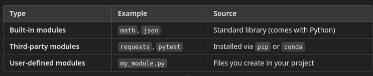

# 1 Introduction to Python

## Module Objectives

1. Understand Python's role in software testing
2. Set up a Python development environment with Jupyter notebooks
3. Create virtual environments
4. Write and execute basic Python code
5. Install and use Python packages
6. Understand Python’s module system

---

## A Brief History of Python

- Created by: Guido van Rossum
- Year released: 1991 (first version 0.9.0)
- Origin: CWI (Centrum Wiskunde & Informatica), Netherlands
- Named after: Monty Python’s Flying Circus (not the snake!)
- Purpose: A simple, readable, and flexible language for both scripting and full-scale development

- Python is managed by the [Python Software Foundation](https://www.python.org)

#### Major Milestones

- Python 2.x (2000–2020): Popular but now deprecated 
- Python 3.x (2008–present): Modern version, cleaner syntax, active development
- 2023–2025: Python ranks in the top 3 of most-used programming languages globally (TIOBE, Stack Overflow surveys)

#### Python's Design Philosophy

Python follows a set of guiding principles known as The Zen of Python:

`There should be one—and preferably only one—obvious way to do it.`

Other important principles include:
- Readability counts
- Simple is better than complex
- Errors should never pass silently
- In the face of ambiguity, refuse the temptation to guess

In the first lab, you will print out the full philosophy "The Zen of Python"

#### Comparison: Python vs. Other Popular Languages

```text 

| Feature            | **Python**         | Java               | JavaScript         | C#                  |
|--------------------|--------------------|---------------------|---------------------|----------------------|
| Typing             | Dynamically typed   | Statically typed    | Dynamically typed   | Statically typed     |
| Syntax             | Clean & readable    | Verbose             | Flexible, web-first | Verbose, .NET-focused |
| Compilation        | Interpreted         | Compiled            | Interpreted         | Compiled             |
| Learning Curve     | Beginner-friendly   | Medium              | Medium              | Medium               |
| Test Libraries     | pytest, unittest    | JUnit, TestNG       | Mocha, Jest         | NUnit, MSTest        |
| Ecosystem Fit      | QA, AI, scripting   | Enterprise systems  | Web & frontend apps | Windows/Desktop apps |
```

## How Python is Implemented

- The most widely used implementation of Python is CPython, written in the C programming language. 
- It is the default and official Python interpreter maintained by the Python Software Foundation.
- When you download Python from python.org, you are downloading CPython.

#### What CPython Does

Compiles Python code to bytecode
- .py files are converted into bytecode (e.g., .pyc files)
- This bytecode is a low-level set of instructions understood by the Python Virtual Machine (PVM)

Executes bytecode using a virtual machine
- The PVM (written in C) interprets the bytecode line by line
- Uses C modules for performance-critical features
- Many core Python modules (like math, datetime, json, and re) are implemented in C for speed and efficiency

#### C Extensions in the Python Standard Library

Some modules are written in C to run faster than interpreted code and avoid the additional overhead of using and interpreter. For example:
- `math`: Fast mathematical operations
- `re`: Regex engine written in C
- `json`:Parsing and serialization
- `datetime`: Time and date manipulations
- `sqlite3`: Database interface to SQLite


#### Python Virtual Machine (PVM)

- The Python Virtual Machine (PVM) is the component of the Python runtime environment that executes your Python programs. 
- It’s the engine that runs Python bytecode instructions, one at a time
- The PVM is implemented in C as part of the CPython interpreter.
- The PVM is the interpreter for Python's intermediate code

#### Bytecode (.pyc)

Python automatically compiles the Python source code into a lower-level representation called bytecode
- Bytecode is platform-independent and optimized for execution.
- This is not machine code, but an intermediate step.
- The PVM reads this bytecode and interprets it line by line, executing each operation.

The PVM handles things like:
- Memory management (allocating space for variables and objects)
- Type checking at runtime
- Function calls and returns
- Looping and conditionals
- Exception handling (try/except)
- Importing modules
- Garbage collection

#### Internals of the PVM

The PVM Includes:
- A bytecode interpreter (reads .pyc files)
- A call stack for managing function calls
- A heap for managing memory objects
- A runtime context that manages global and local variable scopes\An evaluation loop (often written in C) that executes bytecode instructions like:

```text
LOAD_FAST, STORE_FAST (variable ops)
CALL_FUNCTION, RETURN_VALUE (function logic)
BINARY_ADD, COMPARE_OP (math and comparisons)
```

For example, the following Python code

```python
x = 5 + 3
print(x)
```

Has a bytecode representation that looks something like this

```text
LOAD_CONST 5
LOAD_CONST 3
BINARY_ADD
STORE_NAME x
LOAD_NAME print
CALL_FUNCTION
```

## Python as a Language Binding

A language binding refers to the way a programming language (like Python) connects or "binds" to software libraries or tools written in another language—usually C, C++, or Java.
- Python bindings allow you to access and use complex libraries or tools (written in low-level, high-performance languages) directly from Python code.

Why bindings are important for testing and AI?
- Python is not always the fastest language—but it is extremely readable and productive.
- So instead of re-writing everything in Python:
  - Tools and libraries written in faster languages (like C/C++) expose a Python interface so they can be called directly from Python code.
  - This lets testers and developers use powerful tools without having to learn other languages like C

#### Examples

Selenium WebDriver
- Selenium’s core is written in Java, but it provides bindings for Python, so you can automate browsers using Python code.
- [Language Binding Homepage](https://pypi.org/project/selenium/)


```python
from selenium import webdriver

driver = webdriver.Chrome()
driver.get("https://example.com")
print(driver.title)
driver.quit()

```
Pytest
- Pytest itself is written in Python, but it can use bindings to C libraries like `libffi` for plugin extensions or performance.

TensorFlow
- TensorFlow is a Neural Network Library
- Primarily written in C++, but it provides Python bindings so developers can use it easily
- The actual computations run on C++ backends or even optimized CUDA (GPU) code, but is called transparently from Python.

```python
import tensorflow as tf

a = tf.constant(3.0)
b = tf.constant(4.0)
c = a + b
print(c)
```

## Testing with Python

Test friendly Python features
- Simple, readable syntax: Makes test scripts easy to write, read, and maintain 
- Dynamic typing: No need to declare variable types – quick prototyping
- Interpreted language: No compiling – just run and debug on the fly 
- Rich standard library: Built-in modules like unittest, re, json, os help testers 
- Large third-party ecosystem: Tools like pytest, Selenium, requests, Playwright, allure 
- Cross-platform: Write once, run anywhere 

####  Writing Test Cases

Python makes it easy to express a test case clearly:

```python 
def test_login():
assert login("user", "pass") == "Welcome"
```

Web Testing with Selenium

```python 
from selenium import webdriver

driver = webdriver.Firefox()
driver.get("https://example.com")
assert "Example Domain" in driver.title
driver.quit()

```

API Testing with `Requests`

```python
import requests

response = requests.get("https://api.example.com/status")
assert response.status_code == 200
```

Parsing Test Data

```python 
import json

data = '{"status": "pass"}'
result = json.loads(data)
assert result["status"] == "pass"
```
Using Regular Expressions to Validate Input

```python
import re

email = "tester@example.com"
assert re.match(r"[^@]+@[^@]+\.[^@]+", email)
```

#### Python testing frameworks and tools
1. `unittest`: Built-in unit testing framework
2. `pytest`: Advanced testing framework
3. `Selenium`: Browser automation
4. `requests`: API testing and HTTP requests
5. `Playwright`: Modern web automation
6. `json, re`: Data and pattern validation
7. `allure-pytest`: Test reporting


## Setting Up the Python Environment

#### Installing Python

Python can be installed directly from the Python website.
- Installing Python at the system level is useful for doing system level programming 
- For example, running operating system extensions

**The Problem: "Package Conflicts"**

- When working with Python, projects will require install third-party packages (like selenium, requests, or pytest) using pip or conda.
- If everything is installed globally (system-wide), eventually collisions arise
- Different projects need different versions of the same library.
- Upgrading a package for one project might break another.
- The system Python installation can get cluttered or corrupted.

#### The Virtual Environments

A virtual environment is a self-contained directory that contains:
- A clean Python interpreter
- Its own set of installed packages
- A separate pip installer

This means packages can be installed for one in one project without affecting others.

##### Real-World Example

Let’s say:
- Project A needs pytest version 7.0
- Project B needs pytest version6.2

Without a virtual environment, this can’t be done easily on the same machine.

With virtual environments, you can create:

```console 
# For Project A
python -m venv env_projectA
# Activate and install pytest 7.0
```
and separately:

```console 
# For Project B
python -m venv env_projectB
# Activate and install pytest 6.2
```

Each project will have its own version of pytest and won’t interfere with the other
- When activated, your terminal prompt will show the environment name:

```bash
(testenv) $ python
```

Using virtual environments:
- Keeps your projects clean and organized
- Prevents dependency conflicts
- Makes your test automation scripts more reliable and portable

## Anaconda

For this class, we are using the Anaconda tool for running virtual environments and Jupyter notebooks.

The download site is [Anaconda](https://www.anaconda.com/)

## IDEs

Choosing an IDE for Python Development

An IDE (Integrated Development Environment) is a tool that helps you write, test, debug, and manage code. For Python, the most popular IDEs are:

#### PyCharm (JetBrains)

The professional version is available in the lab VM if you want to experiment with it. 
- Designed specifically for Python development
- Great for managing large projects
- Built-in support for virtual environments, testing, and debugging

Editions:
- Community (Free)
- Professional (Paid, with web dev and database support)

[Download PyCharm](https://www.jetbrains.com/pycharm/download/)

[Getting Started with Python in PyCharm](https://www.jetbrains.com/help/pycharm/quick-start-guide.html)

#### Visual Studio Code (VS Code) (Microsoft)

- Lightweight and fast
- Highly customizable
- Great for scripting, test automation, and notebooks
- Extensions for Python, Jupyter, and linting
- Can also be used for other programming languages

[Download VS Code](https://code.visualstudio.com/Download)

[Python Setup Docs](https://code.visualstudio.com/docs/python/python-tutorial)

Recommended extensions
- Python (by Microsoft)
- Jupyter
- Pylint or Flake8

#### Jupyter Notebooks (via Anaconda or standalone)

This is what we will be using in class
- Great for teaching, scripting, and quick test automation
- Interactive format with code cells and markdown
- Ideal for lab work and experimenting

[Jupyter Documentation](https://jupyter-notebook.readthedocs.io/en/stable/)

## The Python Module System

A module is any Python file (.py) that contains reusable code—functions, classes, or variables—that can be imported and used in other programs.

There are three types of modules in Python:



### How the module system works

When you use:

```python
import math
```
Python looks for the module in a specific order:
- Built-in modules
- Current working directory
- `PYTHONPATH` environment variable
- Installed site-packages (`pip install` puts packages here)

You can check where Python looks by inspecting sys.path:

```python
import sys
print(sys.path)
```

#### Finding Modules

You can discover packages:
- https://pypi.org – the official Python Package Index (PyPI)

Using tools like:
- `pip search <name>`  # (deprecated)
- `pip show <name>`

#### Installing Modules

Use pip, Python’s package installer:

```shell
pip install requests
```

Or with conda (if you're using Miniconda/Anaconda):

```shell
conda install requests
```

You can check installed packages:

```shell
pip list
```


