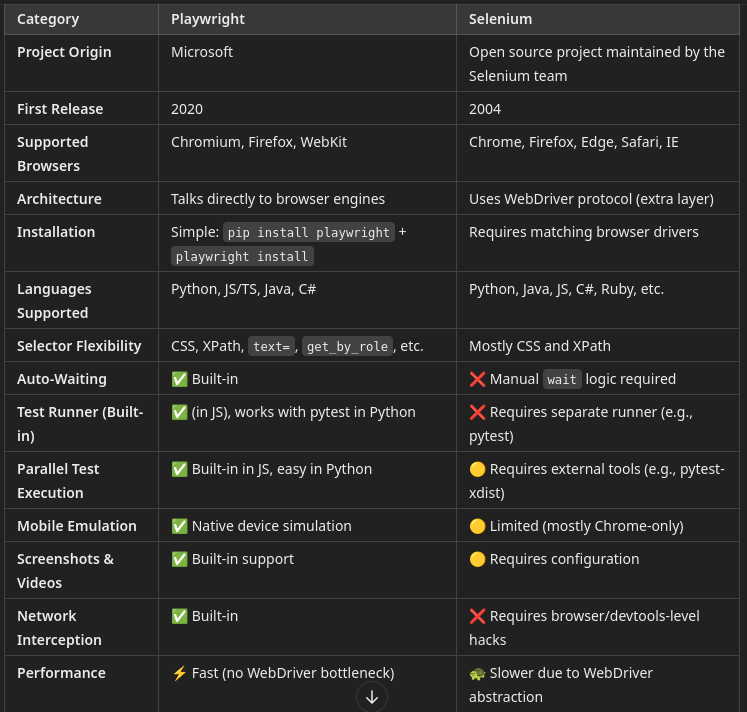
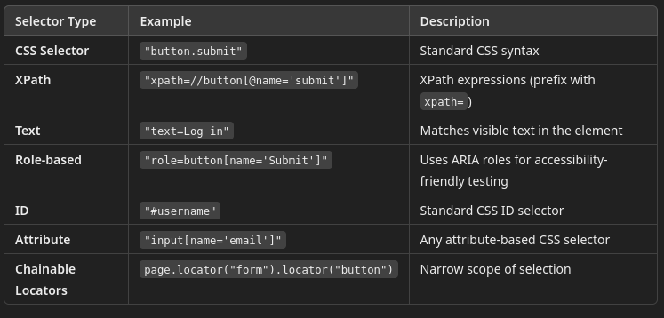
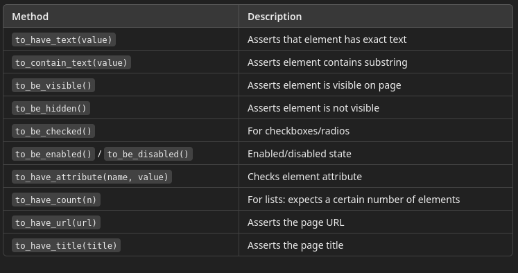

 # 10 - Web Testing
 
## Web Testing

Web based testing generally refers to the process of:

1. Testing the functionality of a web based application using some automatic script runner
2. The code should test the application or the web interface but not both

## Selenium Demo - Python

Generally, it's difficult for testers to sit down and write selenium code

A more effective way is to:
- Use the selenium IDE to capture the logic of the test
- Export to Python
- Rework the python code


### Demo

For this demo, we are using a test website set up for this class

It is the cashflow application which is testing the interface of cashflow line of credit calculator
- The actual application is not being tested
- We are testing the web interface
- A mock application is set up that handles 4 test cases based on the inputs of income, days employed and credit rating
1. [50000, 750, 180] -> eligible for $5,000
2. [49999, 750, 180] -> rejected income too low
3. [50000, 749, 180] -> rejected bad credit
3. [50000, 750, 179] -> rejected, not working long enough

In the demo, we create a test suite that includes the tests for the first two test cases.

The scripts generated are in the Selenium directory in the file `cashflow.side`

The exported python code looks like this

```python
# Generated by Selenium IDE
import pytest
import time
import json
from selenium import webdriver
from selenium.webdriver.common.by import By
from selenium.webdriver.common.action_chains import ActionChains
from selenium.webdriver.support import expected_conditions
from selenium.webdriver.support.wait import WebDriverWait
from selenium.webdriver.common.keys import Keys
from selenium.webdriver.common.desired_capabilities import DesiredCapabilities

class TestCashflow():
    def setup_method(self, method):
        self.driver = webdriver.Firefox()
        self.vars = {}

    def teardown_method(self, method):
        self.driver.quit()

    def test_approve(self):
        self.driver.get("https://exgnosis.org/cashflow/")
        self.driver.find_element(By.LINK_TEXT, "Line of Credit Calculator").click()
        self.driver.find_element(By.ID, "income").send_keys("50000")
        self.driver.find_element(By.ID, "credit").send_keys("750")
        self.driver.find_element(By.ID, "employment").send_keys("180")
        self.driver.find_element(By.NAME, "Calc").click()
        self.driver.find_element(By.CSS_SELECTOR, "h3:nth-child(2)").click()
        assert self.driver.find_element(By.CSS_SELECTOR, "h3:nth-child(2)").text == "Please apply Today!!"
        self.driver.close()

    def test_lowIncome(self):
        self.driver.get("https://exgnosis.org/cashflow/")
        self.driver.find_element(By.LINK_TEXT, "Line of Credit Calculator").click()
        self.driver.find_element(By.ID, "income").send_keys("49999")
        self.driver.find_element(By.ID, "credit").send_keys("750")
        self.driver.find_element(By.ID, "employment").send_keys("180")
        self.driver.find_element(By.NAME, "Calc").click()
        self.driver.find_element(By.CSS_SELECTOR, "h3:nth-child(2)").click()
        assert self.driver.find_element(By.CSS_SELECTOR, "h3:nth-child(2)").text == "Your Income is too low"
        self.driver.close()

```

We can clean up this code by using a fixture

```python
import pytest
from selenium import webdriver
from selenium.webdriver.common.by import By

# Fixture to manage browser setup/teardown
@pytest.fixture
def driver():
    driver = webdriver.Firefox()
    driver.get("https://exgnosis.org/cashflow/")
    driver.find_element(By.LINK_TEXT, "Line of Credit Calculator").click()
    yield driver
    driver.quit()

class TestCashflow:
    def test_approve(self, driver):
        driver.find_element(By.ID, "income").send_keys("50000")
        driver.find_element(By.ID, "credit").send_keys("750")
        driver.find_element(By.ID, "employment").send_keys("180")
        driver.find_element(By.NAME, "Calc").click()
        driver.find_element(By.CSS_SELECTOR, "h3:nth-child(2)").click()
        assert driver.find_element(By.CSS_SELECTOR, "h3:nth-child(2)").text == "Please apply Today!!"
        driver.close()

    def test_lowIncome(self, driver):
        driver.find_element(By.ID, "income").send_keys("49999")
        driver.find_element(By.ID, "credit").send_keys("750")
        driver.find_element(By.ID, "employment").send_keys("180")
        driver.find_element(By.NAME, "Calc").click()
        driver.find_element(By.CSS_SELECTOR, "h3:nth-child(2)").click()
        assert driver.find_element(By.CSS_SELECTOR, "h3:nth-child(2)").text == "Your Income is too low"
        driver.close()

```

## The Page Object Model (POM)

The Page Object Model is a design pattern used in test automation to encapsulate web page elements and behaviors in dedicated Python classes.

In POM:
- Each web page (or component) is represented by a separate class.
- That class exposes methods that perform operations on the page (e.g., login(), submit_form(), get_error_message()).
- Locators (IDs, XPaths, CSS selectors) are stored in one place, inside the page class — not spread across test cases.
- This means if the html changes, only a single location in our test code needs to change

For our cashflow example, we can define the page objects like this:

```python
class CreditCalculatorPage:
    def __init__(self, driver):
        self.driver = driver

    def load(self):
        self.driver.get("https://exgnosis.org/cashflow/")
        self.driver.find_element(By.LINK_TEXT, "Line of Credit Calculator").click()

    def enter_income(self, amount):
        self.driver.find_element(By.ID, "income").send_keys(amount)

    def enter_credit(self, score):
        self.driver.find_element(By.ID, "credit").send_keys(score)

    def enter_employment(self, duration):
        self.driver.find_element(By.ID, "employment").send_keys(duration)

    def calculate(self):
        self.driver.find_element(By.NAME, "Calc").click()

    def get_result(self):
        self.driver.find_element(By.CSS_SELECTOR, "h3:nth-child(2)").click()
        return self.driver.find_element(By.CSS_SELECTOR, "h3:nth-child(2)").text
```

Now when run the tests, we just provide the input to the page object and don't have to reference any of the underling HTML

```python
import pytest
from selenium import webdriver
from selenium.webdriver.common.by import By


@pytest.fixture
def driver():
    driver = webdriver.Firefox()
    yield driver
    driver.quit()

# Page fixture to set up the calculator page
@pytest.fixture
def calc_page(driver):
    page = CreditCalculatorPage(driver)
    page.load()
    return page

class TestCashflow:
    def test_approve(self, calc_page):
        calc_page.enter_income("50000")
        calc_page.enter_credit("750")
        calc_page.enter_employment("180")
        calc_page.calculate()
        result = calc_page.get_result()
        assert result == "Please apply Today!!"

    def test_lowIncome(self, calc_page):
        calc_page.enter_income("49999")
        calc_page.enter_credit("750")
        calc_page.enter_employment("180")
        calc_page.calculate()
        result = calc_page.get_result()
        assert result == "Your Income is too low"
```

---

## Playwright

Playwright is an open-source end-to-end testing and browser automation framework developed by Microsoft. 
- It is designed to test modern web applications across multiple browsers with a single API and high reliability.
- It has the same goal as selenium


Playwright supports these browsers:
- Chromium (Chrome, Edge)
- Firefox
- WebKit (Safari engine)

Language Bindings: Python, JavaScript/TypeScript, Java, and .NET.




#### Code Comparison

```python
# playwright

from playwright.sync_api import sync_playwright

with sync_playwright() as p:
    browser = p.chromium.launch()
    page = browser.new_page()
    page.goto("https://example.com")
    assert page.locator("h1").inner_text() == "Example Domain"
    browser.close()

# selenium
from selenium import webdriver
from selenium.webdriver.common.by import By

driver = webdriver.Chrome()
driver.get("https://example.com")
assert driver.find_element(By.TAG_NAME, "h1").text == "Example Domain"
driver.quit()


```

The Playwright code

`with sync_playwright() as p:`
- Starts the Playwright engine using a context manager.
- sync_playwright(): Initializes Playwright in synchronous mode.
- p: The handle to the Playwright object, which gives access to browser engines like:
  - p.chromium
  - p.firefox
  - p.webkit
 - Why we use with: Ensures Playwright is properly started and cleaned up when the block finishes.

`browser = p.chromium.launch()`
- Launches a Chromium-based browser (like Chrome or Edge).
- Returns: A browser instance.
- Default behavior: Launches the browser in headless mode (no UI).
- Optionally: You can launch in visible mode with launch(headless=False) for debugging.

`page = browser.new_page()`
- Opens a new browser tab/page in the current browser session.
- Returns: A Page object, which you use to interact with the webpage (navigate, click, fill, etc.).

`page.goto("https://example.com")`
- Navigates the newly opened page to the specified URL.
- Waits for: The page to fully load before continuing (auto-wait behavior).

`assert page.locator("h1").inner_text() == "Example Domain"`
- Locates the `<h1>` element on the page
- Gets its inner text, and compares it to "Example Domain".
  - locator("h1"): Finds the first `<h1>` element on the page.
  - inner_text(): Retrieves the text content inside the `<h1>` element.
  - assert  ==  If the text doesn’t match, the test fails.

`browser.close()`
- Closes the entire browser session (all tabs).
- Good practice: Ensures the browser is not left running in the background.

### Types of Selectors in Playwright



Examples

```python
# CSS
page.locator("input#username").fill("admin")

# Text
page.locator("text=Login").click()

# XPath Selector
page.locator("xpath=//div[@class='alert']").text_content()

```

#### Filtering example

Given the following code.

```html
<div class="user-card">
  <h3>Jane Doe</h3>
  <button>Edit</button>
</div>

<div class="user-card">
  <h3>John Smith</h3>
  <button>Edit</button>
</div>
```

We want to click the edit button for John Smith

```python
user_cards = page.locator(".user-card")
john_card = user_cards.filter(has_text="John Smith")
john_card.get_by_role("button", name="Edit").click()

```

### Playwright matchers

Playwright uses expectations similar to hamcrest matchers

Playwright’s expect():
- Auto-waits for the condition to be true (e.g., for an element to be visible)
- Provides clear failure messages
- Makes your tests less flaky and more readable
- It replaces manual assert statements with more semantic, intention-revealing code.

```python
from playwright.sync_api import sync_playwright, expect

with sync_playwright() as p:
    browser = p.chromium.launch()
    page = browser.new_page()
    page.goto("https://example.com")

    heading = page.locator("h1")
    expect(heading).to_have_text("Example Domain")

    browser.close()
```




## Comparison

This is the test code we used for Selenium

```python
import pytest
from selenium import webdriver
from selenium.webdriver.common.by import By

# Fixture to manage browser setup/teardown
@pytest.fixture
def driver():
    driver = webdriver.Firefox()
    driver.get("https://exgnosis.org/cashflow/")
    driver.find_element(By.LINK_TEXT, "Line of Credit Calculator").click()
    yield driver
    driver.quit()

class TestCashflow:
    def test_approve(self, driver):
        driver.find_element(By.ID, "income").send_keys("50000")
        driver.find_element(By.ID, "credit").send_keys("750")
        driver.find_element(By.ID, "employment").send_keys("180")
        driver.find_element(By.NAME, "Calc").click()
        driver.find_element(By.CSS_SELECTOR, "h3:nth-child(2)").click()
        assert driver.find_element(By.CSS_SELECTOR, "h3:nth-child(2)").text == "Please apply Today!!"
        driver.close()

    def test_lowIncome(self, driver):
        driver.find_element(By.ID, "income").send_keys("49999")
        driver.find_element(By.ID, "credit").send_keys("750")
        driver.find_element(By.ID, "employment").send_keys("180")
        driver.find_element(By.NAME, "Calc").click()
        driver.find_element(By.CSS_SELECTOR, "h3:nth-child(2)").click()
        assert driver.find_element(By.CSS_SELECTOR, "h3:nth-child(2)").text == "Your Income is too low"
        driver.close()
```

This is the equivalent playwright code

```python
import pytest
from playwright.sync_api import sync_playwright, expect

# Fixture for Playwright setup and teardown
@pytest.fixture(scope="function")
def page():
    with sync_playwright() as p:
        browser = p.firefox.launch(headless=True)
        context = browser.new_context()
        page = context.new_page()
        page.goto("https://exgnosis.org/cashflow/")
        page.locator("text=Line of Credit Calculator").click()
        yield page
        browser.close()

class TestCashflow:
    def test_approve(self, page):
        page.locator("#income").fill("50000")
        page.locator("#credit").fill("750")
        page.locator("#employment").fill("180")
        page.locator("input[name='Calc']").click()
        page.locator("h3:nth-child(2)").click()
        expect(page.locator("h3:nth-child(2)")).to_have_text("Please apply Today!!")

    def test_lowIncome(self, page):
        page.locator("#income").fill("49999")
        page.locator("#credit").fill("750")
        page.locator("#employment").fill("180")
        page.locator("input[name='Calc']").click()
        page.locator("h3:nth-child(2)").click()
        expect(page.locator("h3:nth-child(2)")).to_have_text("Your Income is too low")

```

### Setup

To install and setup playwright

```shell
pip install playwright # Installs playwright
playwright install # Install the required browser binaries
pip install pytest-playwright # Install the pytest plugin
```

### Run an installation test

Create a test file `test_ex.py` with the contents

```python
def test_example_is_accessible(page):
    page.goto("https://example.com")
    assert page.title() == "Example Domain"
```

Run it with pytest

```shell
pytest test_example.py
```

By default, playwright runs the test in headless mode so you don't see the browser, but you should see the output
- Launches a browser using the built-in page fixture from pytest-playwright.
- Goes to https://example.com.
- Asserts the page title is exactly "Example Domain".

```text
collected 1 item

test_example.py .                                          [100%]

================== 1 passed in X.XXs ==================

```

### Using codegen

The codegen tool is similar to the selenium IDE
- It opens a browser window
- Watches everything you do (like typing, clicking, navigating)
- Generates clean Playwright code — either in Python, JavaScript, TypeScript, or other supported languages.

Run codegen for your target URL

```shell
playwright codegen https://example.com
```

This opens two windows:
- A browser window where you interact with the site
- A terminal/code window showing the generated script

Interact with the site
- Click links
- Fill in inputs
- Submit forms

As you do that, Playwright will live-generate code like:

```python
page.goto("https://example.com")
page.get_by_text("More information").click()
page.fill("input[name='email']", "test@example.com")
```

Choose the output language

```shell
playwright codegen --target python https://example.com
```

Supported values for --target:
- python
- python-async
- javascript
- typescript
- csharp

Save the Script

Once done, copy the generated code and save it in a .py file (e.g., test_generated.py). Then you can run it with:

```shell
pytest test_generated.py
```

Other options

- --device iPhone 13: Emulate mobile devices
- --save-trace trace.zip: Record a trace for debugging
- --output script.py: Automatically save the generated code to a file
- --lang python: Alias for --target python

```shell
playwright codegen --target python --output my_script.py https://example.com
```

If you're running playwright codegen without --output, make sure to copy the code from the terminal before closing the browser — because it auto-quits otherwise.

### Assertions

When you click or hover over elements, Playwright tries to add helpful assertions to the generated code. For example:

After you click a button or check an element's text
- `expect(page.locator("h1")).to_have_text("Welcome")`

This happens when Playwright can confidently detect a stable, testable property like text content, visibility, or state.

#### Trigger Assertions During Recording

- Hover over an element — Playwright may add a visibility assertion.
- Click on static text elements — It may add a text assertion.
- Use the right-click > Inspect selector feature in the browser pane to choose elements more precisely.
- Look for the expect(...) lines appearing in the codegen pane as you interact.

For More Control: Add Manual Assertions After Recording
- If codegen doesn’t generate the exact assertion you want, you can easily add it yourself using:

Current Limitations
- Codegen does not support all possible assertions interactively.
- It mostly focuses on actions (clicks, navigation, form fills) and basic assertions (e.g., element visible or has text).

---

## Pipeline

For reference.

Here is an example of using pytest in a Jenkins pipeine

```text
pipeline {
    agent any

    environment {
        VENV_DIR = "venv"
    }

    stages {
        stage('Checkout') {
            steps {
                echo "Cloning repo..."
                checkout scm
            }
        }

        stage('Set up Python environment') {
            steps {
                echo "Setting up virtual environment..."
                sh 'python3 -m venv $VENV_DIR'
                sh '. $VENV_DIR/bin/activate && pip install --upgrade pip'
                sh '. $VENV_DIR/bin/activate && pip install -r requirements.txt'
            }
        }

        stage('Run Pytest') {
            steps {
                echo "Running tests with pytest..."
                sh '. $VENV_DIR/bin/activate && pytest --tb=short --maxfail=1'
            }
        }

        stage('Archive Test Results') {
            steps {
                junit '**/test-results/*.xml' // if you're using --junitxml in pytest
            }
        }
    }

    post {
        always {
            echo "Cleaning up..."
            cleanWs()
        }
    }
}

```

We can also use github actions

```yaml
name: Python Tests

on:
  push:
    branches: [ main ]
  pull_request:
    branches: [ main ]

jobs:
  test:
    runs-on: ubuntu-latest

    env:
      PYTHON_VERSION: '3.11'
      VENV_DIR: .venv

    steps:
      - name: Checkout code
        uses: actions/checkout@v3

      - name: Set up Python ${{ env.PYTHON_VERSION }}
        uses: actions/setup-python@v4
        with:
          python-version: ${{ env.PYTHON_VERSION }}

      - name: Create virtual environment and install dependencies
        run: |
          python -m venv $VENV_DIR
          source $VENV_DIR/bin/activate
          pip install --upgrade pip
          pip install -r requirements.txt
          # If using Playwright
          playwright install

      - name: Run tests with pytest
        run: |
          source $VENV_DIR/bin/activate
          pytest --junitxml=test-results/results.xml

      - name: Upload test results
        if: always()
        uses: actions/upload-artifact@v3
        with:
          name: junit-results
          path: test-results/results.xml

```

