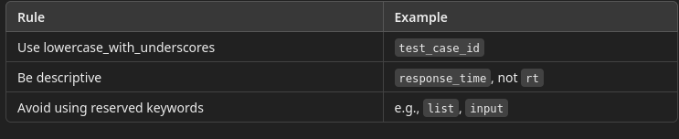
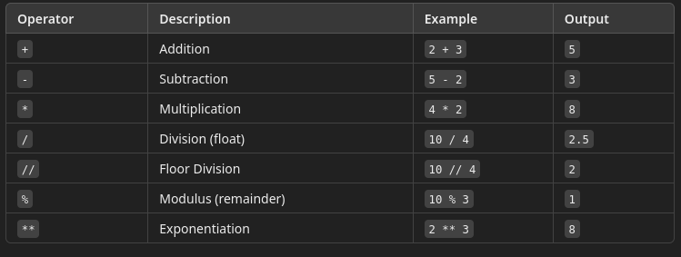
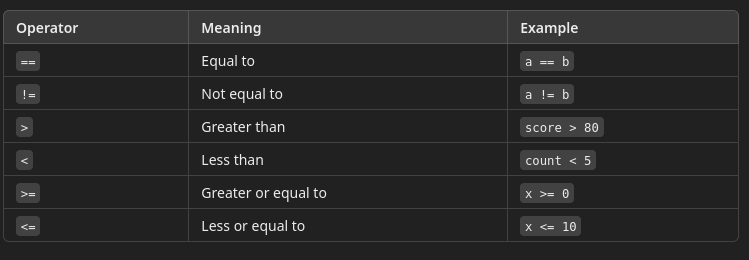
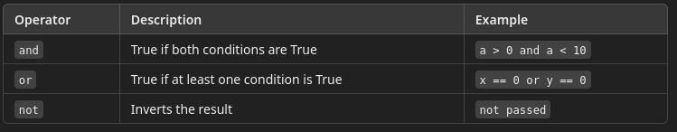
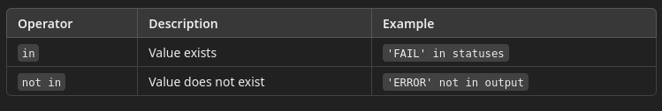
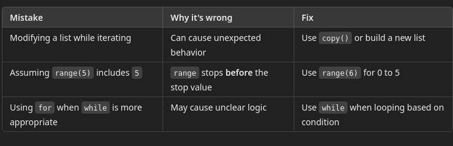
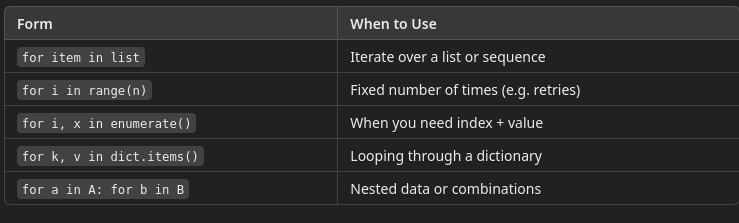
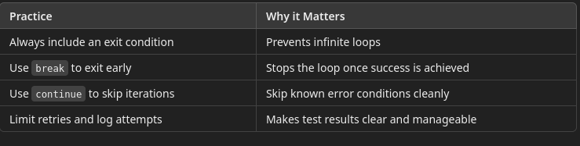

# 2 - Language Basics 1

## Variables and Control Structures

---

## PEP Documents

PEP stands for Python Enhancement Proposal.

A PEP is a design document that provides:
- New features or improvements to the Python language
- Standards and conventions for Python code
- A way for the Python community to propose and discuss changes
- Think of PEPs as the “blueprints” for how Python evolves over time.

#### Purpose of PEPs
- Define new features or syntax (e.g., f-strings, type hints)
- Document decisions made by Python’s core development team
- Establish best practices (e.g., formatting, naming, conventions)
- Encourage open discussion and community input

#### Example: PEP 8 – Style Guide for Python Code

PEP 8 is one of the most famous PEPs. It defines the standard formatting and styling rules for Python code.

Some rules from PEP 8:
- Use 4 spaces per indentation level
- Limit lines to 79 characters
- Use snake_case for variables and functions
- Keep code readable and consistent

[PEP8](https://peps.python.org/pep-0008/)

## Indentation

Indentation refers to the spaces (or tabs) at the beginning of a line of code.
- In many programming languages, indentation is just for readability.
- But in Python, indentation is mandatory and defines the structure of the code.

Python uses indentation instead of curly braces ({}) to define blocks of code, such as:
- if, else, elif blocks
- for and while loops
- try, except, finally blocks
- Function and class definitions
- Without correct indentation, the code won’t run and will raise an `IndentationError`.

Indentation Rules in Python
- Use 4 spaces per indentation level (PEP 8 recommendation)
- Do not mix tabs and spaces
- Indent all lines within the same block equally
- Don’t over-indent (avoid accidental extra spaces)	

Example: Correct Indentation

```python
if status == "PASS":
    print("Test passed")
    log = "Success"
else:
    print("Test failed")

```

Example: Incorrect Indentation (Will Cause Error)

```python
if status == "PASS":
print("Test passed")  # ❌ Not indented
#  Error: IndentationError: expected an indented block
```

## Data Types

Every value is an object, even primitive-looking types like numbers or booleans.

#### int – Integer (Whole Numbers)

```python
count = 42
```

- Internally: Implemented as PyLongObject
- Stored as arbitrary-precision integers (not fixed-size like in C)
- Efficient for arithmetic, but can grow large (e.g., 2**1000)

#### float – Floating-Point Numbers

```python
pi = 3.14159
```
- Internally: Based on the C double type (64-bit floating-point)
- Has limited precision (usually ~15 decimal places)
- Use when decimals are needed, but be aware of floating-point rounding errors

#### str – String (Text)

```python
message = "Test Passed"
```

- Internally: Unicode string, implemented as PyUnicodeObject
- Immutable – any change creates a new string object
- Stored as a sequence of Unicode code points (supports multi-language)

#### bool – Boolean (True/False)

```python
is_valid = True
```

- Internally: Subclass of int (True is 1, False is 0)
- Used in conditionals, test assertions, and flags

#### NoneType – Null Value

```python 
result = None
```

- Internally: Singleton None object
- Used to represent "no value", missing data, or the absence of a result

### Other Built-in Types 

Will be covered in the next module
- list [1, 2, 3]: Mutable, ordered collection
- tuple	(1, 2, 3): Immutable, ordered collection
- set {1, 2, 3}: Unordered, unique items
- dict {"key": "value"}: Key-value pairs, fast lookup
- bytes	b'abc': Binary data, immutable sequence of bytes

## How variables are stored in memory

- When you assign a value to a variable, you’re not storing the value in the variable.
- Instead, the variable references (or points to) an object stored somewhere in memory.

```python
x = 10
```

Here’s what Python does behind the scenes:
- Python creates an object in memory that holds the value 10.
- Python creates a name (variable) x and binds it to the memory address of that object.
- The variable x does not contain the value itself—it holds a reference to where the value is stored.

## Memory Locations

The built-in id() function returns the unique memory address of an object:

```python
x = 10
print(id(x))
# 9771880
```

## Variable Binding

Variable binding means associating a name (like x, username, or result) with a Python object in memory.
- Think of it like putting a label (x) on a box that already contains the value (10).
- You can bind multiple variables to the same object or rebind a variable to a different one.

Example: Variable Binding in Action

```python
a = 100
b = a

print(id(a))  # same ID
print(id(b))  # same ID

a = 200

print(id(a))  # new ID after rebinding
print(id(b))  # still the original ID
```

What This Demonstrates:
- a and b initially point to the same object (100)
- Reassigning 200 to a does not affect b
- This shows that binding is to an object, not to another variable
- Two variables with the same value may share the same ID if Python interns or caches the value.
- When a value is modified, Python may create a new object, and the id() will change.

---

## Implicit and Explicit Type Casting

Type casting means converting one data type into another. Python supports:
- Implicit casting – done automatically when it’s safe
- Explicit casting – done manually using functions like `int()`, `float()`, `str()`

Implicit Casting Example
- Python will automatically convert an int to a float when combining them in an operation:

```python
response_code = 200
timeout_seconds = 0.5
total = response_code + timeout_seconds

print(total)           # 200.5
print(type(total))     # <class 'float'>
```

Explicit Casting Example (Tester Scenario)
- Suppose you're validating that a response time (read as a string) is under a threshold
- API responses and CSV/test data often arrive as strings
- You must cast values explicitly before comparisons or calculations
- Avoid bugs caused by comparing different types (e.g., str vs. int)

```python
response_time = "150"  # string input from a log or JSON
threshold = 200

if int(response_time) < threshold:
    print("Response time is acceptable.")
else:
    print("Response time is too high.")
```

Note that if you remove the cast in the code, it produces and error because you can't compare a string to a number

## None Type – Representing Null Values

None is Python’s way of saying “no value” or “missing data.”
- It’s the equivalent of null in other languages.

```python
result = None
print(type(result))  # <class 'NoneType'>
```

Testing Example – Using None to Flag Incomplete Data
- Imagine a test case that checks if an expected field is present in a response:

```python
username = None  # Could not extract username from page

if username is None:
    print("Username is missing – Test failed")
else:
    print("Username is:", username)

```

- Use `is None` or `is not None` when checking for null values.
- Don’t use `== None` because it’s less reliable.

## Variable Declaration and Use

You declare a variable simply by assigning a value to a name.
- Python automatically determines the type.
- Variables do not have a type, the data they reference has a type

Variable Naming Best Practices
- Makes scripts more readable and maintainable
- Allows you to reuse values and log results
- Simplifies comparisons and validations



Example – Using Variables to Represent Test Results

```python
test_id = "TC_001"
expected_status = "PASS"
actual_status = "FAIL"

print(f"Test ID: {test_id}")
print(f"Expected: {expected_status}, Actual: {actual_status}")

if expected_status == actual_status:
    print("Test passed")
else:
    print("Test failed")
```

## Operators in Python – What Testers Need to Know

#### Arithmetic Operators
- Used for math operations.



Example: Comparing `/` and `//`

```python
total_tests = 7
testers = 2

# True division (returns float)
average_per_tester = total_tests / testers
print("Using / :", average_per_tester)   # Output: 3.5

# Floor division (returns whole number)
whole_tests_per_tester = total_tests // testers
print("Using //:", whole_tests_per_tester)  # Output: 3
```

Explanation
- `/` gives the exact result (e.g., 3.5 tests per tester)
- `//` rounds down to the nearest whole number (e.g., each tester gets 3 tests, 1 leftover)

This is useful in test automation when you’re:
- Splitting test cases evenly
- Creating batches for distribution
- Avoiding partial results (e.g., index positions)

#### Comparison Operators

Used to compare two values. Returns a boolean (True or False).



#### Logical Operators

Used to combine conditional statements.



Truthy and Falsy Values in Python

When using logical operators like and, or, or not, Python treats some values as True and others as False even if they aren’t explicitly True or False.
- This is known as truthiness and falsiness.

Truthy Values: These are treated as True in logical conditions:
- Non-empty strings: "test"
- Non-zero numbers: 1, -5, 3.14
- Non-empty lists/tuples/dictionaries: [1], ("a",), {"key": "value"}

Falsy Values: These are treated as False:
- None
- False
- 0, 0.0
- Empty string: ""
- Empty list, tuple, set, or dictionary: [], (), {}, set()

####  Membership Operators

Check if a value exists in a collection.



```python
statuses = ["PASS", "SKIP", "FAIL"]
if "FAIL" in statuses:
    print("At least one test failed")

```

## Conditional Statements: if, elif, else

These are used to run different blocks of code depending on whether a condition is True or False.

```python
if condition:
    # code block
elif another_condition:
    # another code block
else:
    # fallback block
```

```python
status_code = 404

if status_code == 200:
    print("Test Passed")
elif status_code == 404:
    print("Page Not Found – Test Failed")
else:
    print("Unexpected response")

```

#### Using multiple elif clauses
- if and elif conditions are checked in order, top to bottom.
- As soon as one condition is True, the rest are skipped.
- Only one block of code will run, even if multiple conditions could match.

```python
response_code = 503

if response_code == 200:
    print("Success – Test Passed")
elif response_code == 301:
    print("Redirect – Check URL")
elif response_code == 403:
    print("Forbidden – Permission Denied")
elif response_code == 404:
    print("Not Found – Check Resource")
elif response_code == 500:
    print("Server Error – Try again later")
else:
    print("Unhandled response code:", response_code)

```

- The program checks the value of response_code.
- It compares it against several known HTTP status codes using elif.
- If none of the conditions match, it falls through to the else block.
- In this example, 503 triggers the else statement because it's not explicitly handled.

#### Nested if statements

```python
response_code = 200
content_type = "application/json"

if response_code == 200:
    print("Status OK")

    if content_type == "application/json":
        print("Valid JSON response – Test Passed")
    elif content_type == "text/html":
        print("Unexpected HTML content – Warning")
    else:
        print("Unknown content type")
        
elif response_code == 404:
    print("Not Found – Test Failed")

elif response_code == 500:
    print("Server Error – Try again later")

else:
    print("Unhandled status code")
```

#### Dangling Else

A dangling else happens when it’s unclear which if an else belongs to
- Especially when multiple if statements are not properly indented.
- In Python, indentation defines the scope, so this can lead to logic bugs, even if the code runs without a syntax error.

Dangling else
- You might think the else belongs to the first if
- But due to the indentation, the else is actually bound to the inner if (content_type check), not the response_code check.
- This means the "Unexpected response" message will never print unless the response_code is 200 and the content_type is not JSON.

```python
response_code = 200
content_type = "text/html"

if response_code == 200:
    if content_type == "application/json":
        print("Valid response")
else:
    print("Unexpected response")

```

Corrected example

```python
response_code = 200
content_type = "text/html"

if response_code == 200:
    if content_type == "application/json":
        print("Valid response")
    else:
        print("Unexpected content type")
else:
    print("Response not OK")

```

## Looping: for loops

A for loop in Python is used to iterate over a sequence (like a list, tuple, string, or range).
- It executes a block of code once for each item in the sequence.
- Unlike other languages (like C or Java), Python’s for loop doesn’t use a counter by default
- You iterate directly over elements.

#### Example: Looping over a list

```python
test_cases = ["Login Test", "Checkout Test", "Logout Test"]

for case in test_cases:
    print("Running:", case)
```

#### Example:  Looping with range()

Use range() when you need to loop a fixed number of times, often with numeric indices.
- Use this form when retrying a test, simulating load, or looping through indexed data.

```python
for i in range(3):
    print("Attempt number:", i + 1)

print('---')

# range(start, stop)
for i in range(1, 4):
    print(i)  # prints 1, 2, 3

print('---')

# range(start, stop, step)
for i in range(0, 10, 2):
    print(i)  # prints even numbers: 0, 2, 4, 6, 8

```
#### Example

Strings are iterable character-by-character:

```python
message = "PASS"

for letter in message:
    print(letter)
```

#### Looping Over a Dictionary

Use .items() to get both key and value:

```python
test_results = {
    "TC001": "PASS",
    "TC002": "FAIL",
    "TC003": "SKIP"
}

for case_id, result in test_results.items():
    print(f"{case_id} => {result}")

```

#### Looping with enumerate()

This lets you access both the index and value in a loop:

```python
checks = ["username", "password", "submit"]

for index, check in enumerate(checks):
    print(f"Step {index + 1}: Checking {check}")

```

#### Common Errors



#### Summary




## While Loops 

A while loop lets you repeat a block of code as long as a condition remains True.
- Unlike a for loop (which runs a fixed number of times), a while loop is ideal when you:
  - Don't know in advance how many iterations are needed
  - Need to wait for a condition to change
  - Want to retry something until it succeeds or times out

#### Example: Retrying a Failing Step
- This pattern is commonly used to retry flaky test steps, wait for elements in UI testing, or poll an API for a ready status.

```python
attempt = 0
max_attempts = 5
step_passed = False

while attempt < max_attempts and not step_passed:
    print(f"Attempt {attempt + 1} – Running test step...")
    # Simulate a successful step on 3rd try
    if attempt == 2:
        step_passed = True
        print("Step passed.")
    attempt += 1

if not step_passed:
    print("!!! Step failed after retries.")
```

#### Example: Waiting for Test Data Availability

```python
ddata_available = False
checks = 0

while not data_available and checks < 3:
    print("Checking if test data is available...")
    checks += 1

    # Simulate availability on the second check
    if checks == 2:
        data_available = True

if data_available:
    print("Data is now available.")
else:
    print("Data still unavailable.")
```

#### Important Tips




## Control Statements in Loops: break, continue, and pass

In Python, loops can be fine-tuned using control flow statements. These allow you to:
- Exit a loop early (break)
- Skip part of a loop and move to the next iteration (continue)
- Placeholder for future logic (pass)

#### break – Exit a Loop Immediately

break is used to stop a loop before it finishes all its iterations.

```python
attempts = 0
max_attempts = 5

while attempts < max_attempts:
    print(f"Attempt {attempts + 1}")
    if attempts == 2:  # Simulate success
        print("Test step succeeded. Exiting retry loop.")
        break
    attempts += 1

```

#### continue – Skip to the Next Iteration

continue tells Python to skip the rest of the loop body and move to the next iteration.

```python
steps = ["login", "load_dashboard", "unstable_feature", "logout"]

for step in steps:
    if step == "unstable_feature":
        print("Known issue – skipping:", step)
        continue
    print("Executing step:", step)
```

#### pass – Do Nothing (Placeholder)

pass is a no-operation statement. It does nothing and is often used:
- As a placeholder for future logic
- When you need syntactically valid code but don’t want to write logic yet


## Breaking Out of an Inner Loop

Assume we are running tests across multiple environments, 
- In each environment, you retry a failing test up to 3 times. 
- If the test passes, you want to break out of the retry loop but continue testing in the next environment.

```python
environments = ["staging", "qa", "production"]

for env in environments:
    print(f"Environment: {env}")
    attempt = 0

    while attempt < 3:
        print(f"  Attempt {attempt + 1}...")

        # Simulate a success on second attempt in 'qa'
        if env == "qa" and attempt == 1:
            print("Test passed, no more retries needed.")
            break  # Breaks only out of the inner while loop

        attempt += 1

    print("Moving to next environment.\n")

```

- The outer for loop iterates over environments.
- The inner while loop handles retries.
- break stops the retry loop only when the test passes in that environment.
- The outer loop continues to the next environment.

## `else` Clause with Loops

In Python, both for and while loops can have an else block.
- The else block runs only if the loop completes normally (i.e., not exited via break).
- If the loop is interrupted with break, the else block is skipped.

The use case is:
- looping to find a particular condition
- break out of the loop when the condition is found
- If the break never happens, we never found the condition
- The else clause executes the "I didn't find it" code

```python
attempts = 0
max_attempts = 3

while attempts < max_attempts:
    print(f"Attempt {attempts + 1}")
    if attempts == 1:  # simulate success on 2nd try
        print("Success!")
        break
    attempts += 1
else:
    print("Max attempts reached – operation failed.")

```