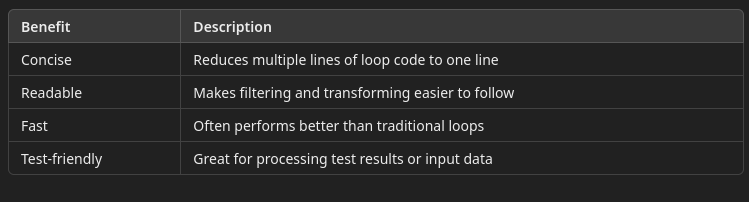
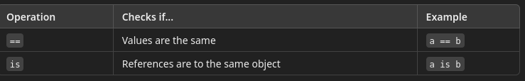
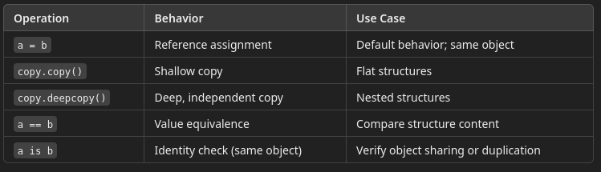

# 3 Data Structures

---


## Data Structures

Data structures organize data and can be thought of as containers for data
- Different data structures have been created in computer science to deal with the performance and size characteristics of data structures.
- Different tasks call for different ways of organizing data
  - Some tasks require ordered data (e.g., test steps in a sequence)
  - Others need unique values (e.g., test IDs without duplicates)
  - Some require key-based lookups (e.g., accessing results by test ID)
  - Others benefit from fixed, unchangeable values (e.g., test environment co
- This means that we see implementations of the same types of data structures across programming languages.
- Python has several different native data structures as well as some that are defined in external modules

--- 

## Python Native Data Structures

The four native data structures in Python are

### The List

A list is an ordered, mutable collection of items.
- Mutable means that we can change the size of the list or change what it contains
- This means that when data is changing or the amount of data is changing, these changes can be recorded in an existing list

Common Use Cases:
- Store test case IDs, input data, or test results
- Track multiple attempts or retries

In the example below, note that we can add and delete elements to the list
- Elements in the list are accessed with indices

```python
test_cases = ["TC001", "TC002", "TC003"]

print(test_cases)
# Add a new test case
test_cases.append("TC004")
print(test_cases)

# Remove a failed case
test_cases.remove("TC002")
print(test_cases)

# change the first element
test_cases[0] = "TC008"
print(test_cases)

```

### The Tuple - Immutable Sequences

A tuple is an ordered, immutable collection of items.
- Syntactically, it is written with round brackets while lists have square brackets
- It looks a lot like a list but the contents cannot be changed, nor can elements be added or deleted
- Common Use Cases:
  - Store fixed test configurations (e.g., environment settings)
  - Use as keys in dictionaries
- Individual elements can still be accessed using indices, but indexed items can never appear on the left hand side of the '=' operator

```python
env_config = ("staging", "US", "Chrome")
print(env_config)

# Access by index
print(env_config[1])  # "US"

```

###  Dictionaries – Key-Value Pairs

A dictionary stores data as key-value pairs and is unordered.
- Unordered means that the order in which the elements are stored is not necessarily the same as the order in which they were added.
- This is because the internal storage structure uses hashing as opposed to using sequential "slots"
- This means that there are fast lookups
- Great for structured data, exports and imports easily to JSON
- Keys must be unique and hashable
- Slightly more overhead in memory
- Represented by `{key1 : value1, key2: value2,...}`

```python
test_result = {
    "id": "TC001",
    "status": "PASS",
    "duration": 1.45
}

# Access by key
print(test_result["status"])

# Add nested data
test_result["details"] = {"steps": 5, "logs": "path/to/log.txt"}
print(test_result)

```

### Sets – Unique Unordered Collections

A set is an unordered collection of unique items.
- Common Use Cases:
  - Deduplicate test data
  - Compare actual vs. expected results
- Unordered because it uses an internal structures similar to the keys in a map
- The order in which items are stored is not necessarily the same as the order they were added
- We can do set operations: unions, intersections and differences
- Operations are fast
- Braces `{}` are used to distinguish a set from a list or tuple

```python
actual = {"TC001", "TC002", "TC003"}
expected = {"TC001", "TC002", "TC004"}

# Find missing or extra tests
print("Missing:", expected - actual)
print("Unexpected:", actual - expected)

```
Advantages:
- Automatically removes duplicates
- Supports fast membership testing

Drawbacks:
- Unordered
- Items must be immutable


### frozenset – Immutable Set 

We can make a set immutable by freezing it. 
- This means that no further additions or other modifications are allowed
- Useful when a set needs to be constructed then fixed after the construction processes is done
- frozenset supports all standard set operations but returns a new frozenset.

```python
mutable_set = {"PASS", "FAIL", "SKIP"}
immutable_set = frozenset(mutable_set)

mutable_set.add("PENDING")
#immutable_set.add("PENDING") # Error

print(mutable_set)
print(immutable_set)
# Output: frozenset({'PASS', 'FAIL', 'SKIP'})
```
---

## List Indexing

- Indexing is how you access elements in a list using square brackets ([]). 
- Python lists are ordered, so every item has a position starting from index 0.

#### Accessing Elements by Index

- Indexing starts at 0
- Negative indices access elements from the end

```python
tests = ["Login", "Checkout", "Logout"]

print(tests[0])  # "Login"
print(tests[1])  # "Checkout"
print(tests[-1])  # "Logout"
print(tests[-2])  # "Checkout"
```

#### List Slicing – Accessing a Range

slice is a way to extract a subsection of a sequence—like a portion of a list or a tuple.
- Think of it as saying: “Give me part of this list from position X to position Y.”
- Slices are useful when:
  - You only need a subset of data
  - You want to copy or clone part of a structure
  - You want to manipulate or analyze a segment of test results or steps

####  Syntax of a Slice

`sequence[start:stop:step]`


- Use colon notation start:stop to get a slice (sub-list):
- If one of the indices is missing, it means "starting from the first" or "up to and including the last"
  - start: the index to begin from (inclusive)
  - stop: the index to stop at (exclusive)step: how many elements to skip
- If any part is left out, Python fills in defaults:
  - start defaults to 0
  - stop defaults to the end
  - step defaults to 1

```python
tests = ["Login", "Checkout", "Search", "Logout"]

print(tests[1:3])  # ['Checkout', 'Search']
print(tests[:3])  # ['Login', 'Checkout', 'Search']
print(tests[1:])  # ['Checkout', 'Search', 'Logout']

```

#### Example with a List (Test Steps)

```python
steps = ["start", "login", "upload", "verify", "logout", "report"]

# First 3 steps
print(steps[:3])  # ['start', 'login', 'upload']

# Last 2 steps
print(steps[-2:])  # ['logout', 'report']

# Every other step
print(steps[::2])  # ['start', 'upload', 'logout']

```

####  Example with a Tuple (Immutable Test Configs)

```python
config = ("Chrome", "staging", "EN", "US", "mobile")

# Middle part of the tuple
print(config[1:4])  # ('staging', 'EN', 'US')

# Reversing a tuple
print(config[::-1])  # ('mobile', 'US', 'EN', 'staging', 'Chrome')

```


## Slices of sets and dictionaries

We can't take slices of set
- Sets are unordered. 
- There's no index to slice by.
- Use cases like slicing make no sense on data without a guaranteed order.

We can't take slices of dictionaries
-  Dictionaries are key-based, not index-based.
- If you need to slice values or keys, you must convert them to a list first:

---

## List Comprehensions

A list comprehension is a concise, readable way to create a new list by processing or filtering elements from an existing iterable (like a list, range, or string).
- It's like writing a for-loop and an if condition in a single line, and it's great for clean, expressive code.

#### Basic Syntax

```python
[expression for item in iterable if condition]
```

Which is a shorthand for

```python
new_list = []
for item in iterable:
    if condition:
        new_list.append(expression)

```


#### Example: Create Test IDs

```python
test_ids = [f"TC{i:03}" for i in range(1, 6)]
print(test_ids)  # ['TC001', 'TC002', 'TC003', 'TC004', 'TC005']
```

- Builds test case names like TC001, TC002, etc.
- "TC{i:03}" pads numbers with leading zeros.

#### Example: Filter Passed Test Results

```python
results = ["PASS", "FAIL", "PASS", "SKIP", "FAIL"]
passed = [r for r in results if r == "PASS"]
print(passed)  # ['PASS', 'PASS']
```

Filters only test results that passed.
- Clean alternative to writing for loop + if.

#### Example: Transform and Filter in One Step

```python
durations = [1.2, 2.5, 0.8, 3.1]
rounded = [int(d) for d in durations if d > 1.0]
print(rounded)  # [1, 2, 3]

```
Filters out durations ≤ 1.0
- Converts each float to an integer (truncates decimals)

---

## Variable Assignment and Copying in Data Structures

In Python, variables don’t store the data structure directly—they store a reference (a pointer) to the actual object in memory. In the following code, the memory location of the data are the same.

`backup_data` does NOT get a new copy of the list.
- It simply points to the same list in memory as `test_data`.

```python
test_data = [1, 2, 3]
backup_data = test_data
print( id(test_data))
print( id(backup_data))
```

If you modify backup_data, it will also change test_data, because both variables refer to the same object.

```python
backup_data.append(4)
print("test_data:", test_data)  # [1, 2, 3, 4]
```
This can lead to unintended side effects in test code when:
- Reusing test fixtures
- Passing shared objects between test cases

#### Memory Concept
- Variables are labels pointing to objects in memory.
- Assigning one variable to another does NOT copy the object.
- You get two labels pointing to the same memory location.

#### Equivalence vs. Identity



```python
a = [1, 2, 3]
x = [1, 2, 3]
b = a

print(a == b)  # True – same contents
print(a is b)  # True – same memory location

print(a == x)  # True – same contents
print(a is x)  # False – different memory location
```

## Shallow vs. Deep Copy

When you do want a separate copy, there are two main options:

Shallow Copy
- Copies only the top-level structure, not the nested ones.

```python
import copy

original = [[1, 2], [3, 4]]
shallow = copy.copy(original)

shallow[0][0] = 99
print("Original:", original)  #  Also shows 99!
```

Deep Copy
- Creates a full, independent copy, including nested structures.

```python
import copy

original = [[1, 2], [3, 4]]
deep = copy.deepcopy(original)

## They are eqivalent
print(original == deep)

deep[0][0] = 99
print("Original:", original)  # Unchanged: [[1, 2], [3, 4]]
print("Deep copy:", deep)     # Modified: [[99, 2], [3, 4]]
```



#### Real-World Example 

Imagine you have a test template with steps, and you want to make custom variations per test run.

```python
import copy

template = {
    "steps": ["login", "upload file", "logout"]
}

# Wrong way (shared object)
test1 = template
test2 = template

test2["steps"].append("check logs")

print("Shallow Test 1 steps:", test1["steps"])  #  Unexpectedly includes "check logs"

# Right way  (reset template)
template = {
    "steps": ["login", "upload file", "logout"]
}
test1 = copy.deepcopy(template)
test2 = copy.deepcopy(template)

test2["steps"].append("check logs")

print("Deep Test 1 steps:", test1["steps"])  #  Unchanged
```
---

## Tuples with Mutable Elements

- A tuple is an immutable, ordered collection in Python.
- Once a tuple is created, you cannot add, remove, or change its top-level elements.
- Tuples can contain lists, dictionaries, or other mutable objects. 
- While you cannot change the tuple itself, you can modify the contents of the mutable object inside it.

 #### Example: Tuple with a List Inside

The tuple itself has two elements:
- A string "staging" (immutable)
- A list ["login", "upload", "logout"] (mutable)

```python
test_config = ("staging", ["login", "upload", "logout"])
test_config[1].append("check logs")

print(test_config)
# Output: ('staging', ['login', 'upload', 'logout', 'check logs'])

```

Tuple stores references, not copies:
- When you create a tuple with a list inside it, the tuple stores a pointer to the list’s memory location.

The list itself is mutable and lives in memory:
- Modifying the list (e.g., .append()) does not affect the tuple’s structure.

The tuple still points to the same list object—but the content of that list has changed in memory.

