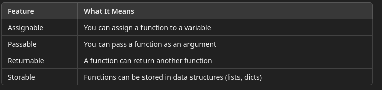
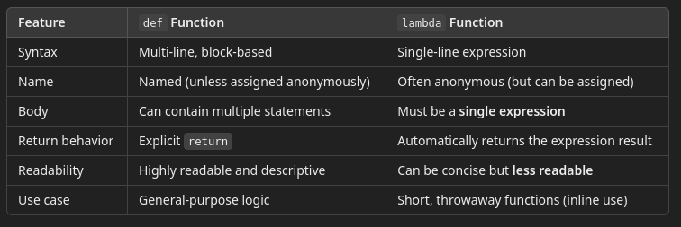
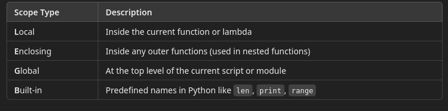

# 4 - Functions

## Functions in Python

A function is a reusable block of code designed to perform a specific task. 
- In Python, functions are defined using the `def` keyword
- They may accept parameters and return results.

```python
def check_status(code):
    if code == 200:
        return "OK"
    else:
        return "FAIL"

```

### Functional Programming Language

A functional programming language treats functions as the primary building blocks of logic. 

In pure functional languages (like Haskell):
- Functions are stateless (no side effects)
- Everything is immutable
- Functions can be composed (chained together)
- Recursion often replaces loops
- Functions are first class objects and are treated exactly the same as data

Immutability means that when a function processes a data item, the input remains unchanged.
- The processed data is returned as new object.
- Just like in math, if we have the function f(x) = 2x
  - Applying the functon to a `2` does not change the `2` but it creates a new value `4`
- Given the discussion of how data is stored in module 1
  - Functional languages do not assign values to named memory locations
  - Instead, the variable is a pointer that gets bound to a memory locations
  - Changing the value of the variable does not change the memory location contents

### Functions as First Class Objects




#### Example: Assigning a Function to a Variable

```python
def greet():
    return "Hello!"

say_hello = greet  # assigning function to variable
print(say_hello())  # calling via new name
```

#### Example: Passing a Function to Another Function

```python
def run_test(step):
    print("Running:", step())

def step_one():
    return "Step 1 passed"

run_test(step_one)

```

#### Example: Returning a Function from a Function\

```python
def choose_validator(type):
    if type == "length":
        return lambda s: len(s) > 5
    else:
        return lambda s: s.isalpha()

validator = choose_validator("length")
print(validator("python"))  # True
```

## Defining Functions

- A function body is a piece of executable code. 
- Because it is a piece of data, it has a type.
- In the following code, `greet` and `f` are variables that contain executable code.

```python
def greet():
    return "Hello!"

f = greet

print(id(greet))
print(type(greet))

print(id(f))
print(type(f))
```
There are two ways to define a function. 

The first is to use the `def` key
- This tells Python that this is a function object
- And we bind a named variable to the function object

The second is to use a lambda function.
- This is syntax that telly Python that it is looking at a function object
- But it is not binding it to a variable.
- This allows us to pass the function object without having to declare unnecessary variables

```python
def z(name):
    print(f"Hello `{name}`")

x = lambda name: print(f"Goodbye `{name}`")

z("Alice")
x("John")
(lambda name: print(f"Please Stay `{name}`"))("Fido")
```

In the above example, we are using a function in 3 different ways
- The named way with `z`
- A Lambda assigned to a variable `x`
- A Lambda function not assigned to anything

Note that no matter how define the function, using the trailing `()` tells Python to execute the code.
- The last form is often called ephemeral or transitory since we can execute the function once, then it can be no longer referenced.
  - This can be useful when we want some temporary functionality that we will not reuse

Revisiting one of the previous examples

```python
def choose_validator(type):
    if type == "length":
        return lambda s: len(s) > 5
    else:
        return lambda s: s.isalpha()

validator = choose_validator("length")
print(validator("python"))  # True
```

In the following example, we want a short piece of filtering logic without having to write a formal function definition or use a variable/

```python
results = ["PASS", "FAIL", "PASS", "SKIP"]

failures = list(filter(lambda r: r == "FAIL", results))
print(failures)  # ['FAIL']

```

`filter(function, iterable)`:

The built-in filter() function is used to select items from a list (or any iterable) that meet a specific condition.
- It applies the function (in this case, a lambda) to each item in the list.
- If the function returns True, the item is kept.
- If the function returns False, the item is discarded.

## The Formal Definition

[The Python Tutorial]https://docs.python.org/3/tutorial/controlflow.html#defining-functions()

### Return Values

Functions always return a value

For named functions defined with `def`
- Computed values are returned using the `return` statement
- If there is no return statement, the function returns `None`

For Lambda functions
- There is usually not a `return` statement since Lambda functions are usually one line
- The value of the expression is the return value (like `1 + 2`)
- If the expression does not produce a result, `None` is returned

#### Comparing def Functions vs. lambda Functions



The problem with named functions, is that we may lose track of the original name if we assign it to another variable ("assigned anonymously"). In the example below, there is an eventual discrepancy between the original name of the function and the name of the variable that is bound to it.

```python
def hello():
    return "Hi"

anon = lambda: "Hi"

print(hello.__name__)  # 'hello'
print(anon.__name__)   # '<lambda>'

greet = hello
print(greet.__name__)  # 'hello'

```

When to use def: 
- Multi-step logic
- Reuse in multiple places
- Clear documentation or readability needed

When to use lambda:
- Short, one-off operations
- As arguments to functions like map(), filter(), or sorted()

#### Best Practices for Using lambda

Use lambda when:
- The function is short and simple
- It's being used temporarily or inline
- You're passing it as an argument (e.g., to sorted, filter, map, or GUI callbacks)

Avoid lambda when:
- The function has multiple steps or conditions
- You need debugging or logging
- The purpose of the function isn't immediately obvious

## Lambda Functions with Varying Parameters

Niladic Lambda (0 parameters)

```python
greet = lambda: "Hello, world!"
print(greet())  # Hello, world!
```

Monadic Lambda (1 parameter)

```python
square = lambda x: x * x
print(square(4))  # 16
```

Diadic Lambda (2 parameters)

```python
add = lambda a, b: a + b
print(add(3, 5))  # 8

```

####  Default and Keyword Parameters in Lambda Functions

Because lambdas are limited to a single expression, default and keyword parameters must remain simple and concise.

```python
greet = lambda name="Tester": f"Hello, {name}!"
print(greet())             # Hello, Tester!
print(greet("Alice"))      # Hello, Alice!

```

```python
add = lambda x=0, y=0: x + y

print(add(5, 3))         # 8
print(add(x=2, y=10))    # 12
print(add(y=7))          # 7 (x defaults to 0)

```

---

## Understanding Variable Scope

Scope refers to the region of your code where a variable is visible and can be accessed.
- It answers the question: “Where can I use this variable?”

Scopes are important because they:
- Prevent naming conflicts between different parts of your program
- Make code easier to read, debug, and test
- Protect variables from accidental changes outside their intended area
- Help control memory usage and lifetime of variables

#### Python’s Scope Hierarchy: The LEGB Rule



```python
global_var = "I’m global"  # G: Global scope

def outer():
    enclosing_var = "I’m in outer"  # E: Enclosing scope

    def inner():
        local_var = "I’m local"  # L: Local scope
        print(local_var)
        print(enclosing_var)
        print(global_var)

    inner()

outer()
# inner()  - Error, out of scope

```

Remember that functions are just variables that contain executable code.
- In the above example `inner` is a variable that has is local to `outer()`
- That means that it can be called inside `outer()` but not outside of `outer()`

#### Local Scope

Variables created inside a function exist only within that function.

```python
def run_test():
    result = "PASS"
    print(result)

run_test()
# print(result)   Error: result is not defined (outside scope)
```

#### Global Scope

Variables defined outside any function are global. 
- You can access them from anywhere in the file.
- However, variables defined inside a function are assumed to be local unless told otherwise

```python
status = "READY"

def check():
  print(status)  # ✅ Allowed

check()


count = 10

def increment():
  global count
  count += 1


increment()
print(count)

```

#### Common Scope Mistake: Shadowing

Using the same variable name in different scopes can lead to shadowing, where the inner variable hides the outer one.

```python
name = "Global"

def show():
    # global name
    name = "Local"
    print(name)  # Prints "Local", not "Global"

show()
print(name)

```

#### Real-World Example 

```python
timeout = 5  # global default

def run_case(case_id):
    timeout = 2  # local override
    print(f"Running {case_id} with timeout {timeout}")

run_case("TC007")
print(timeout)  # Still 5 – the global value was not affected

```

Understanding scope helps you:
- Avoid test result corruption
- Prevent race conditions in shared test data
- Debug variable values more easily

---

## NonLocal Scope

The nonlocal keyword in Python is used to modify a variable in an enclosing (but not global) scope—typically in nested functions.

This is especially important in closures and decorators, or whenever you need to maintain state across function calls within a local context.

This is the enclosing scope analogue to the global keyword

#### Without nonlocal — Doesn’t Work

```python
def outer():
    count = 0

    def inner():
        nonlocal count
        count += 1
        print("Inner count:", count)

    inner()
    print("Outer count:", count)

outer()
```

### Real-World Testing Example

Suppose you’re building a test result tracker inside a test suite.

```python
def test_tracker():
    passed = 0

    def record(result):
        nonlocal passed
        if result == "PASS":
            passed += 1
        return passed

    return record

track = test_tracker()
print(track("PASS"))  # 1
print(track("FAIL"))  # 1
print(track("PASS"))  # 2

```

The record function is retaining access to the passed variable.

nonlocal allows it to increment the passed counter without redefining it locally.

## Closures

A closure is a function that:
- Is defined inside another function
- Remembers variables from the outer (enclosing) function's scope—even after the outer function has finished running

Closures are useful when you want to:
- Retain state between function calls without using global variables
- Implement function factories
- Create custom behavior in test utilities or configuration functions

```python
def make_counter():
    count = 0

    def increment():
        nonlocal count
        count += 1
        return count

    return increment

counter = make_counter()
print(counter())  # 1
print(counter())  # 2
print(counter())  # 3

```
- increment() is a closure because it “remembers” the count variable from make_counter() even after make_counter() has returned.
- nonlocal allows the inner function to modify count.


## Decorators

A decorator is a function that:
- Takes another function as an argument
- Adds extra behavior (before/after) without modifying the original function’s code
- Returns a new function

Decorators are great for:
- Logging
- Timing
- Access control
- Automatically modifying or enriching test functions

#### Example: A Simple Logging Decorator

```python
# Define the decorator
def report(func):
  def wrapper(*args, **kwargs):
    print(f"Starting test: {func.__name__}")
    result = func(*args, **kwargs)
    print(f"Finished test: {func.__name__}")
    return result
  return wrapper

# Apply the decorator using @ syntax
@report
def run_login_test():
  print("Executing login test logic...")

# Call the test
run_login_test()

```

The decorator `@report` is a message to python that when `run_login_test()` is called, the wrapper report should be called instead.  
- This allows the logger to be us without having to go through all the code and replace `run_login_test()` with the decorated version

### Additional Generator Example

```python
# Define a generator function
def my_gen():
    print("Generator started")
    yield 1
    print("Yielded 1")
    yield 2
    print("Yielded 2")
    # No more yield, generator will now return (implicitly)

# ---- PART 1: Using for-loop (automatically handles StopIteration) ----

print("=== Using for-loop ===")
for value in my_gen():
    print(f"Received: {value}")

# ---- PART 2: Using next() manually (shows StopIteration) ----

print("\n=== Using next() manually ===")
g = my_gen()  # This returns a generator object

try:
    print(next(g))  # Starts the generator, yields 1
    print(next(g))  # Resumes, yields 2
    print(next(g))  # No more yields -> StopIteration raised here
except StopIteration:
    print("Generator is done (StopIteration caught)")

```