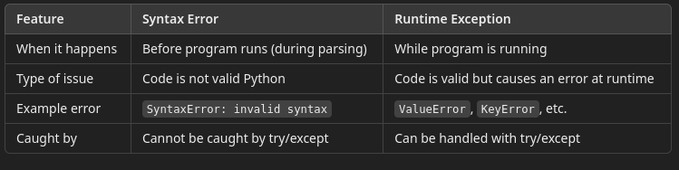

# 5- Exceptions

##  Definition of an Exception

- An exception is an event that disrupts the normal flow of a program’s execution when an error occurs. 
- When Python encounters a problem it cannot resolve (e.g. dividing by zero, accessing an invalid index), it raises an exception.
- If the exception is not handled, it causes the program to crash.

In this example, divide by zero exception is not handled

```python
print("Starting test case...")
print(10 / 0)  # Raises a ZeroDivisionError
print("This line will not run.")

```

### Syntax Errors vs. Runtime Exceptions



In testing, unhandled exceptions can:
- Cause automated test suites to crash prematurely
- Hide important test results
- Leave systems in an unclean state
- Make debugging more difficult

#### Example Without Exception Handling

```python
def test_login(user):
    print("Running login test")
    return user["username"]

test_login({})  # Raises KeyError
```

#### Example With Exception Handling

```python
def test_login(user):
    print("Running login test")
    try:
        return user["username"]
    except KeyError:
        print("Test failed: 'username' not found in user data.")
        return None

test_login({})
print("Program keeps running...")
```

## Common Built-in Exceptions in Python

Python provides many built-in exceptions. 
- These are errors that commonly occur due to invalid data, wrong operations, or logic bugs.
- Understanding these exceptions helps you:
  - Debug failing tests
  - Write more resilient automation
  - Handle edge cases effectively

### ValueError

Raised when a function receives an argument of the right type, but an inappropriate value.

```python
int("abc")  # Cannot convert a non-numeric string to integer
# ValueError: invalid literal for int() with base 10: 'abc'
```

Common in:
- Input validation
- Data parsing in test fixtures

### TypeError

Raised when an operation or function is applied to an object of the wrong type.

```python
len(42)  #  You can’t take the length of an integer
# TypeError: object of type 'int' has no len
```

Common in:
- Unexpected function arguments
- Misused APIs in test frameworks

### IndexError

Raised when trying to access an invalid index in a sequence (like a list or string).

```python
items = [1, 2, 3]
print(items[5])  #  Index out of range
# IndexError: list index out of range
```

Common in:
- Looping over test data
- Test case table lookups

### KeyError

Raised when trying to access a non-existent key in a dictionary.

```python
user = {"name": "Alice"}
print(user["email"])  # No 'email' key
# KeyError: 'email'
```

Common in:
- Parsing API responses
- Reading test case metadata

Best practice: Use `.get()` to avoid this:

```python
print(user.get("email", "Not found"))
```

### ZeroDivisionError

Raised when dividing a number by zero.

```python
value = 10 / 0  # Cannot divide by zero
#ZeroDivisionError: division by zero
```
 Common in:
 - Calculating averages, ratios, percentages in test data

Best practice: Check before dividing:

```python
if denominator != 0:
result = numerator / denominator
else:
result = None
```

###  FileNotFoundError

Raised when trying to open a file that does not exist.

```python
with open("missing_file.txt") as f:
data = f.read()
# FileNotFoundError: [Errno 2] No such file or directory
```
Common in:
- Loading config files
- Reading test data or test results

Best practice:

```python
import os

if os.path.exists("data.txt"):
with open("data.txt") as f:
content = f.read()
else:
print("File not found.")

```

### AssertionError (Very Important for Testers)

Raised when an assert statement fails.
- This is often used in tests to validate expected outcomes.

```python
assert 2 + 2 == 5, "Math check failed!"
# AssertionError: Math check failed!
```

Common in:
- Writing unit and integration tests
- Custom test validations

Best practice: Include a message to describe the failure:

```python
assert status == "PASS", f"Expected PASS, got {status}"
```

---

## Basic Try-Except Blocks

The basic structure is:

```python
try:
    # risky code here
except SomeException:
   # error handling here
```

#### Example:

```python
try:
    value = int("42a")  # This will raise a ValueError
except ValueError:
    print("Could not convert string to integer.")
```

Explanation:
- Code inside the try block is executed.
- If a ValueError occurs, the except block runs.
- The program does not crash.

###  Catching a Specific Exception

You should catch only the exceptions you expect to occur. 
- This leads to more precise error handling and fewer hidden bugs.


```python
def get_age():
    user_input = "twenty"
    try:
        age = int(user_input)
        print("Age:", age)
    except ValueError:
        print("Please enter a valid number.")

```


Only a ValueError will be caught here. 
- Other types of exceptions (like TypeError) will still raise an error.
- This prevents inappropriate handling of other exceptions, which masks they are occuring

### Catching Multiple Exceptions

Sometimes, you expect more than one type of error. 
- You can catch them using a tuple of exception types.

```python
def process_test_data():
    test_data = None
    try:
        print(test_data["result"])  # TypeError
    except (KeyError, TypeError) as e:
        print(f"Caught exception: {e}")

```

Explanation:
- This code may raise a KeyError if the key is missing or a TypeError if test_data is not a dictionary.
- Both are caught and handled together.

### Catching All Exceptions

You can catch any exception by using: `except Exception as e:`

This is useful when:
- You're not sure which error might occur
- You want to log all unexpected errors
- You’re wrapping risky test steps

```python
def run_test_case():
    try:
        result = 10 / 0  # Raises ZeroDivisionError
    except Exception as e:
        print(f"Test failed due to unexpected error: {e}")

```

Warning: 
- While except Exception is helpful for logging and debugging, don’t overuse it.

Avoid this pattern unless you’re:
- Logging the error
- Re-raising it later
- Handling errors in critical areas (e.g., test runner loops)

---

## Using else and finally

Python provides two optional clauses you can use with try-except blocks:
- else
- finally

These help organize code clearly by:
- Separating error-handling from normal logic (else)
- Guaranteeing resource cleanup or reporting (finally)


### Purpose of else: Runs If No Exception Is Raised

Use else when you want to execute code only if the try block succeeds—that is, no exception was raised.

```python
def parse_input(value):
    try:
        num = int(value)
    except ValueError:
        print("Invalid input. Must be a number.")
    else:
        print(f"You entered: {num}")

```

Why use else?
- Keeps your code cleaner
- Prevents running success logic inside the try block
- Helps separate the error handling from the normal path

### Purpose of finally: Always Runs

The finally block always runs:
- Whether or not an exception was raised
- Whether or not the exception was handled
- Even if there’s a return statement in try or except

#### Example: Using finally to close a file

```python
def read_file(file_path):
    try:
        f = open(file_path)
        content = f.read()
        print("File read successfully.")
    except FileNotFoundError:
        print("File not found.")
    finally:
        print("Cleaning up...")
        try:
            f.close()
        except:
            pass  # f might not be defined if open() failed
```

Why use finally?
- Ensures cleanup, like:
  - Closing files or databases
  - Releasing locks
  - Logging test status
  - Releasing browser sessions
  - Essential in test teardown logic


#### Example: Full try-except-else-finally block

```python
def validate_test_data(data):
    try:
        assert isinstance(data, dict)
    except AssertionError:
        print("Invalid test data: expected a dictionary.")
    else:
        print("Data is valid.")
    finally:
        print("Validation attempt finished.")

validate_test_data({"test": "login"})
#  Data is valid.
# Validation attempt finished.

validate_test_data("wrong format")
# Invalid test data: expected a dictionary.
# Validation attempt finished.
```

#### Typical Testing Use Case: Teardown After Exception

Even if the test crashes, the cleanup still happens.

```python
def run_test_with_teardown():
    try:
        print("Running test...")
        raise Exception("Unexpected failure")
    except Exception as e:
        print(f"Error: {e}")
    finally:
        print("Cleaning up test environment...")

run_test_with_teardown()

```

---

## Using raise to Trigger Exceptions

The raise statement is used to manually throw an exception. This is useful when you want to indicate an error condition or validate test data.

```python
def validate_score(score):
    if score < 0:
        raise ValueError("Score cannot be negative.")

validate_score(-5)  # Raises ValueError

```
raise can be used inside any block—functions, loops, conditionals—whenever an error condition needs to be flagged.

### Creating Test Validations

You can use raise to validate test conditions in a more controlled way than using assert.

```python
def check_status(status):
    if status != "PASS":
        raise AssertionError("Test failed")

check_status("FAIL")

```
### raise AssertionError(...) vs assert

`raise AssertionError(...)` lets you customize the error message and handle exceptions more explicitly
- `assert` is concise but can be disabled when Python is run in optimized mode (python -O)
- For test code, both are valid: just ensure you provide useful messages.

## Defining Your Own Exception Class

You can define custom exceptions by subclassing Exception. 
- This is helpful when you want to signal specific types of test failures.

```python
class TestFailure(Exception):
    pass

def run_test():
    raise TestFailure("Login failed due to timeout")

try:
    run_test()
except TestFailure as e:
    print(f"Custom failure: {e}")

```

Use custom exceptions to:
- Represent specific error conditions
- Allow selective exception handling (e.g., distinguish between system errors vs. validation errors)
- Improve readability and debugging in test frameworks

---

##  Exception Propagation and Scope

If a function raises an exception and doesn’t handle it, the exception bubbles up the call stack until it’s caught or the program crashes.


```python
def step_one():
    raise ValueError("Step failed")

def test_case():
    try:
        step_one()
    except ValueError as e:
        print(f"Test case error: {e}")
```

The error started in step_one() but was caught in the outer scope.

### Using raise in Nested Function Calls

You can also use raise to re-raise an exception after logging or handling it partially.

```python
def step():
    try:
        raise RuntimeError("Step error")
    except RuntimeError as e:
        print("Logging error:", e)
        raise  # Re-raises the original exception
```

---

## Best Practices for Testers

### Fail Fast: Catching vs. Letting Exceptions Bubble
- Catch only what you need—let unexpected exceptions bubble up to crash the test or get logged
- This makes bugs more visible during development

```python
def run_test():
    # Do not over-catch
    result = 10 / 0  # Will raise ZeroDivisionError

run_test()  # Fail fast is useful during development

```

### Logging Exceptions for Debugging

Logging helps debug failures without hiding them.

```python
import logging

def test_step():
    try:
        raise ValueError("Invalid input")
    except ValueError as e:
        logging.error(f"Test error: {e}")

```

### Wrapping Test Steps with try/except for Graceful Failure

Wrap individual steps—not entire test scripts—so that logs are helpful and informative.

```python
def login():
    raise TimeoutError("Login server slow")

try:
    login()
except TimeoutError:
    print("Login timed out")

```

