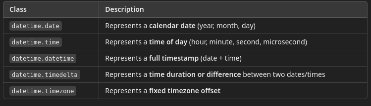

# 7: Date and Time Module

This module covers how to work with dates and times in Python, focusing on practical use cases for testers—such as generating timestamps, parsing log times, and validating API time fields.

---

## How Dates and Times Are Stored

- Python handles dates and times using the built-in datetime module. 
- This module provides several classes to represent points in time, durations, and calendar-related operations.

"


#### datetime.date

Stores only the date (no time).

```python
from datetime import date

d = date(2025, 3, 24)
print(d.year, d.month, d.day)
```

Internally:
- Stored as Gregorian calendar values: year, month, and day (integers)
- No time or timezone information is included

#### datetime.time

Stores time (without any associated date).

```python
from datetime import time

t = time(13, 30, 0)
print(t.hour, t.minute, t.second)
```

Internally:
- Stores hour, minute, second, microsecond
- Has optional tzinfo for timezone (default is None)

#### datetime.datetime

This is the most commonly used object—it combines both date and time.

```python
from datetime import datetime

dt = datetime(2025, 3, 24, 13, 30, 0)
print(dt)
```

Internally:
- Stores all components: year, month, day, hour, minute, second, microsecond
- Also has optional tzinfo to handle time zones

#### datetime.timedelta

Stores a duration (not a timestamp). You can use it to calculate date differences.

```python
from datetime import timedelta

delta = timedelta(days=2, hours=3)
print(delta.total_seconds())  # 183600.0
```

Internally:
- Stored as days, seconds, and microseconds
- Allows easy arithmetic between datetime objects

#### datetime.timestamp()

You can convert a datetime to a POSIX timestamp (seconds since Jan 1, 1970 UTC).

```python
dt = datetime(2025, 3, 24, 13, 30)
ts = dt.timestamp()
print(ts)  # e.g., 1742813400.0
```

- Python stores this internally as a floating-point number
- Good for compact numeric storage or interfacing with systems that use epoch time

### Time Zones (Naive vs. Aware)

#### Naive datetime (default):

No timezone information attached.

```python
naive = datetime.now()
print(naive.tzinfo)  # None
```

#### Aware datetime:

Includes timezone information.

```python
from datetime import timezone
aware = datetime.now(timezone.utc)
print(aware.tzinfo)  # UTC  
```

Use aware datetimes when comparing across systems or storing logs.


---

## Getting the Current Date and Time

```python
from datetime import datetime, date, time

now = datetime.now()
print("Current datetime:", now)

today = date.today()
print("Today's date:", today)

current_time = datetime.now().time()
print("Current time:", current_time)
```

---

## Formatting Dates and Times with `strftime`

```python
now = datetime.now()
formatted = now.strftime("%Y-%m-%d %H:%M:%S")
print("Formatted datetime:", formatted)
```

### Common format codes:
- `%Y` = full year
- `%m` = zero-padded month
- `%d` = zero-padded day
- `%H` = hour (24hr)
- `%M` = minute
- `%S` = second

Use formatted strings for logs, reports, or naming output files.

---

## Parsing Strings into Dates with `strptime`

```python
from datetime import datetime

timestamp = "2024-11-03 14:30:00"
dt = datetime.strptime(timestamp, "%Y-%m-%d %H:%M:%S")
print("Parsed datetime:", dt)
```

Why it's useful:
- Converts strings from logs or reports into datetime objects you can compare or sort.

---

## Date Arithmetic with `timedelta`

```python
from datetime import timedelta

now = datetime.now()
one_week_ago = now - timedelta(weeks=1)
next_hour = now + timedelta(hours=1)

print("One week ago:", one_week_ago)
print("Next hour:", next_hour)
```

### Use Cases:
- Check how long a test took
- Simulate expiration or future dates

---

## Timestamps and Epoch Time

```python
ts = datetime.now().timestamp()
print("Current timestamp:", ts)

# Convert timestamp back to datetime
dt = datetime.fromtimestamp(ts)
print("Converted back:", dt)
```

### Use Cases:
- Compare with epoch times in API responses
- Store compact numeric time values

---

## Time Zones and UTC Handling

```python
from datetime import timezone

now_utc = datetime.now(timezone.utc)
print("Current time in UTC:", now_utc)
```

### Notes:
- Always use UTC in logging and APIs for consistency.
- Use `pytz` or `zoneinfo` to work with other timezones.

---

## The `time` Module

```python
import time

start = time.time()
time.sleep(1.5)
end = time.time()

print("Elapsed time:", end - start, "seconds")
```

### Use Cases:
- Introduce test delays
- Time performance of a test step

---

## Date and Time in Testing Contexts

### Generate dynamic test data:
```python
future_date = datetime.now() + timedelta(days=7)
print("Expiry date:", future_date.strftime("%Y-%m-%d"))
```

### Validate time in an API response:

```python
api_date = "2024-11-03T14:30:00"
try:
    dt = datetime.strptime(api_date, "%Y-%m-%dT%H:%M:%S")
    print("Valid datetime:", dt)
except ValueError:
    print("Invalid date format")
```

---

## Best Practices and Pitfalls

- Use `strftime` and `strptime` for consistent format handling
- Stick with UTC when logging or comparing datetimes
- Use `timedelta` instead of hardcoded math
- Be careful comparing naive and timezone-aware datetime objects
- Consider DST issues and localization when working with user times


