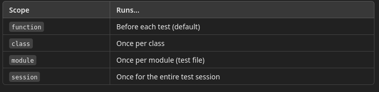
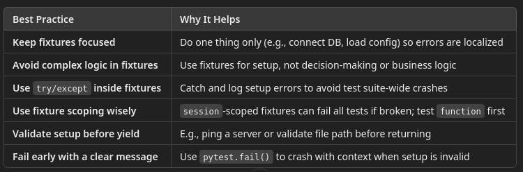
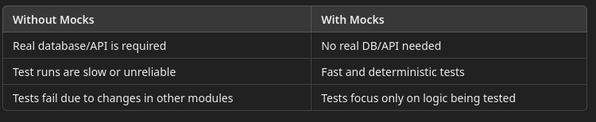

# 9 Unit Testing with pytest

## Introduction to pytest and Unit Testing
   
- pytest is a popular testing framework for Python.
- It's used to write unit tests, which verify small, isolated pieces of code (usually functions or methods).
- Supports powerful features like:
  - Fixtures
  - Parameterization
  - Easy integration into CI/CD

[pytest home](https://docs.pytest.org/en/stable/)

## Installation and Basic Components 

```shell
pip install pytest
```

#### Key Components:

1. Test function: Python function that starts with `test_`
2. Assertion: Checks if actual result matches expected
3. Fixtures: Reusable setup logic for tests

## Test File and Function Naming, Test Directory Structure
   
#### Naming Conventions:

- Test file: Must be named like `test_*.py` or `*_test.py`
- Test functions: Must be named like `test_something()`

#### Test Directories

A fundamental principle of unit testing is that test code is decoupled from application code
- The presence of test code intermingled with production code can result in corrupt test
  - You wind up testing the combination of application code plus test code
- Application code should clean, meaning that it can be moved from a test environment into prod environment without modification
- Also necessary for CICD automation

As of newer pytest versions (6.x+), you technically don’t need __init__.py in the test folder if you:
- Stick to simple top-level test scripts
- Don’t use relative imports between test files
- But it's still a good practice to include it, especially for larger or structured test suites.

#### Directory Structure (example):

```text
project/
│
├── app/
│   └── logic.py
│
└── tests/
├── __init__.py         👈 This marks the folder as a Python package
├── test_logic.py
└── test_helpers.py
```

Without __init__.py, Python might not be able to resolve imports like:

```python
from tests.test_helpers import helper_function
```

THis allows even more complex test directory structures like this

```text
tests/
├── __init__.py
├── unit/
│   ├── __init__.py
│   └── test_basic.py
└── integration/
    ├── __init__.py
    └── test_db.py

```

The `__init__.py` files allows Python to treat the tests/ folder as a package, meaning:
- You can import test modules or utilities from within that directory.
- You can use relative or absolute imports between test files.
- It ensures compatibility with test runners and linters that expect a package structure.

## Writing and Executing Basic Tests
   
For this part, we will have the test file in the same directory as the application file

Application Logic 
- In the file `logic.py`

```python
def add(a, b):
    return a + b
```

Test Case
- In the file `test_logic.py`

```python
from app.logic import add

def test_add_001():
    assert add(2, 3) == 5

def test_add_002():
    assert add(2, -3) == -1

def test_add_003():
    assert add(-2, -3) == -5
```

Run the tests from the main root directory

```shell
$ pytest
(labs) rod@exgnosis:~/working/pytest$ pytest
================================================================================== test session starts ===================================================================================
platform linux -- Python 3.12.9, pytest-8.3.5, pluggy-1.5.0
rootdir: /home/rod/working/pytest
plugins: anyio-3.7.1
collected 3 items                                                                                                                                                                        

tests/test_logic.py ...                                                                                                                                                            [100%]

=================================================================================== 3 passed in 0.01s ====================================================================================
```

---

## Assertions

An assertion is a way to verify that something is true in your code. In pytest, assertions are used to check if:
- A function returns the correct result
- A condition is met
- An exception is raised
- A value exists or doesn't exist

If the assertion fails, pytest will report the failure with details showing what was expected and what was actually returned — making it incredibly useful for debugging test failures.

### Python assert Statement

`pytest` builds on top of the built-in Python assert keyword but enhances the output when tests fail. 

Basic Form:

```python
assert <condition>
```
If <condition> is `False`, an `AssertionError` is raised, and the test fails.

#### Common Forms of pytest Assertions

```python
def test_sum():
    assert 3 + 2 == 5
    assert (3 + 2 > 5) is False

def test_none_value():
    value = None
    assert value is None

def test_substring():
    assert "test" in "pytest"

def test_list_membership():
    assert 3 in [1, 2, 3, 4]

def test_range():
    assert 10 >= 10
    assert 5 < 10

def test_equal_with_message():
    assert 3 * 3 == 9, "Multiplication result is incorrect"

def test_type():
    result = "hello"
    assert isinstance(result, str)
```

###  Exception Handling with pytest.raises

Use pytest.raises() to assert that a function raises a specific exception.

```python
import pytest

def divide(a, b):
    if b == 0:
        raise ValueError("Cannot divide by zero!")
    return a / b

def test_divide_zero():
    with pytest.raises(ValueError):
        divide(5, 0)

# Check the message in the exception
def test_divide_zero_msg():
    with pytest.raises(ValueError, match="divide by zero"):
        divide(5, 0)

```
---

## Setup and Teardown and Fixtures

### Defining setup and teardown

In testing, we often need to prepare some state or data before running tests, and sometimes clean things up afterward:
- Opening and closing a file
- Starting and stopping a database connection
- Setting up test data in memory

These are referred to as:
- Setup – runs before your test
- Teardown – runs after your test

### Legacy Setup/Teardown Functions

You can define setup and teardown functions with specific names in the test module.

```python
# test_sample.py


def setup_function(function):
    print(f"\n[Setup] Preparing to run {function.__name__}")

def teardown_function(function):
    print(f"[Teardown] Finished running {function.__name__}")

def test_addition():
    print("Running addition test")
    assert 2 + 3 == 5

def test_subtraction():
    print("Running subtraction test")
    assert 5 - 2 == 3


```

Running this with the following command produces the following result

```shell
(labs) $ pytest -s test_helpers.py
==================================================================================================== test session starts =====================================================================================================
platform linux -- Python 3.12.9, pytest-8.3.5, pluggy-1.5.0
rootdir: /tests
plugins: anyio-3.7.1
collected 2 items                                                                                                                                                                                                            

test_helpers.py 
[Setup] Preparing to run test_addition
Running addition test
.[Teardown] Finished running test_addition

[Setup] Preparing to run test_subtraction
Running subtraction test
.[Teardown] Finished running test_subtraction
```

Limitations of Legacy Setup/Teardown
- Can only use one setup_function and teardown_function per file
- Hard to reuse or apply selectively
- Not suitable for parameterized or scoped setup

## Modern Fixtures

A fixture is a reusable function that runs before (and optionally after) your test. Fixtures are:
- Modular: You can define them once and reuse them in multiple tests
- Configurable: Can be scoped to a function, class, module, or session
- Composable: One fixture can use another fixture

#### Example: Setup Fixture

Notice that the fixture is passed to the test function

```python
import pytest

# Define a fixture
@pytest.fixture
def sample_data():
    print("Generating sample data")
    return {"username": "testuser", "role": "admin"}

# Use it in a test by name
def test_user_role(sample_data):
    assert sample_data["role"] == "admin"


```

Running the tests:

```shell
(labs) $ pytest -s
==================================================================================================== test session starts =====================================================================================================
platform linux -- Python 3.12.9, pytest-8.3.5, pluggy-1.5.0
rootdir: /fix
plugins: anyio-3.7.1
collected 1 item                                                                                                                                                                                                             

test_fixtures.py Generating sample data
.

===================================================================================================== 1 passed in 0.00s ======================================================================================================
```

`@pytest.fixture` is a decorator that tells pytest to treat a function as a fixture
- Marked as a reusable piece of setup code that can be shared across one or more tests.

Fixtures allow you to:
- Set up resources (e.g., test data, DB connections, mocks) before a test runs
- Optionally clean them up after the test runs
- Inject the resource into the test function automatically via parameters


##  Fixture with Teardown using yield

It helps to think of the fixture as a wrapper with two parts
- The setup that runs before the test function executes
- The teardown codd that runs after the test executes

The `yield` statement was seen with generators
- It suspends execution of a function until it is called again
- Then it resumes with the code after the `yield` statement

Modifying the precious example to do teardown code

```python
import pytest

# Define a fixture
@pytest.fixture
def sample_data():
    print("\nSetup: Generating sample data")
    yield {"username": "testuser", "role": "admin"}
    print("Teardown: Cleanup resources")

# Use it in a test by name
def test_user_role(sample_data):
    print("Running test function")
    assert sample_data["role"] == "admin"

```

Running this produces:

```shell
(labs) $ pytest -s
==================================================================================================== test session starts =====================================================================================================
platform linux -- Python 3.12.9, pytest-8.3.5, pluggy-1.5.0
rootdir: fix
plugins: anyio-3.7.1
collected 1 item                                                                                                                                                                                                             

test_fixtures.py 
Setup: Generating sample data
Running test function
.Teardown: Cleanup resources

===================================================================================================== 1 passed in 0.00s ======================================================================================================

```

### Using Multiple Fixtures

More than one fixture can be called by a test.
- There are two cases
- Independent fixtures
- Dependent where one fixture calls another fixture

In the independent case, the fixtures are wrapped around the test function in the order they are specified

```python
import pytest

# Define a fixture
@pytest.fixture
def sample_data():
    print("\nSetup: Generating sample data")
    yield {"username": "testuser", "role": "admin"}
    print("Teardown: Cleanup sample data")

# Independent other fixture
@pytest.fixture
def other_fixture():
    print("\nSetup: other fixture")
    yield 
    print("Teardown: other fixture")

# Use them in a test
def test_user_role(sample_data,other_fixture):
    print("Running test function")
    assert sample_data["role"] == "admin"

# Use in a different order
def test_other(other_fixture,sample_data):
    print("Running other test function")
    assert sample_data["role"] == "admin"
```

Running this produces

```shell
(labs) /fix$ pytest -s
==================================================================================================== test session starts =====================================================================================================
platform linux -- Python 3.12.9, pytest-8.3.5, pluggy-1.5.0
rootdir: /fix
plugins: anyio-3.7.1
collected 2 items                                                       

test_fixtures.py 

Setup: Generating sample data
Setup: other fixture
Running test function
Teardown: other fixture
Teardown: Cleanup sample data

Setup: other fixture
Setup: Generating sample data
Running other test function
Teardown: Cleanup sample data
Teardown: other fixture


===================================================================================================== 2 passed in 0.01s ======================================================================================================
```

### Dependency

In the following code, fix2 calls fix1 as part of its setup.
- This allows reusability of chunks of setup code

```python
import pytest

@pytest.fixture
def fix1():
    print(">> Setting up fix1")
    yield "fixture 1"
    print("<< Tearing down fix1")

@pytest.fixture
def fix2(fix1):  # fix2 depends on fix1
    print(">> Setting up fix2")
    yield f"{fix1} + fixture 2"
    print("<< Tearing down fix2")

def test_example(fix2):
    print(f"Test received: {fix2}")
    assert "fixture 1" in fix2
```

Execution Order:
- pytest sees that test_example() needs fix2
- It inspects fix2 and notices it depends on fix1
- So it sets up fix1 first
- Then it sets up fix2, which uses the value of fix1
- Then it calls test_example(fix2)
- After the test, the yield teardown steps clean up in reverse order (fix2, then fix1)

```shell
(labs) /fix$ pytest -s
==================================================================================================== test session starts =====================================================================================================
platform linux -- Python 3.12.9, pytest-8.3.5, pluggy-1.5.0
rootdir: /fix
plugins: anyio-3.7.1
collected 1 item                                                                                                                                                                                                         

test_fixtures.py 
>> Setting up fix1
>> Setting up fix2
Test received: fixture 1 + fixture 2
<< Tearing down fix2
<< Tearing down fix1


===================================================================================================== 1 passed in 0.00s ======================================================================================================
```

## Fixture Scope 

By default, fixtures run once per test function, but you can customize this using the scope argument:

```python
@pytest.fixture(scope="module")  # Options: function, class, module, session
def setup_module_data():
    return {"module": "utilities"}
```

- `function`:	Before each test (default)
- `class`: Once per class
- `module`: Once per module (test file)
- `session`: Once for the entire test session

```python
import pytest

# Function-scoped fixture: runs before *every test function*
@pytest.fixture(scope="function")
def setup_function_scope():
    print("--[Function Scope] Setup")
    yield
    print("--[Function Scope] Teardown")

# Class-scoped fixture: runs once per test class
@pytest.fixture(scope="class")
def setup_class_scope():
    print("++++[Class Scope] Setup")
    yield
    print("++++[Class Scope] Teardown")

# Module-scoped fixture: runs once per file
@pytest.fixture(scope="module")
def setup_module_scope():
    print("============[Module Scope] Setup")
    yield
    print("============[Module Scope] Teardown")

# ---------------------- Function-scope usage ----------------------

def test_func1(setup_function_scope, setup_module_scope):
    print("*** Running test_func1")
    assert True

def test_func2(setup_function_scope, setup_module_scope):
    print("*** Running test_func2")
    assert True

# ---------------------- Class-scope usage ----------------------

class TestExample:
    def test_method1(self, setup_function_scope, setup_class_scope, setup_module_scope):
        print("*** Running test_method1 in TestExample")
        assert True

    def test_method2(self, setup_function_scope, setup_class_scope, setup_module_scope):
        print("*** Running test_method2 in TestExample")
        assert True

```

This produces the output

```shell
labs) /fix$ pytest -s
==================================================================================================== test session starts =====================================================================================================
platform linux -- Python 3.12.9, pytest-8.3.5, pluggy-1.5.0
rootdir: /fix
plugins: anyio-3.7.1
collected 4 items                                                                                                                                                                                                            

test_fixtures.py 
============[Module Scope] Setup
--[Function Scope] Setup
*** Running test_func1
.--[Function Scope] Teardown
--[Function Scope] Setup
*** Running test_func2
.--[Function Scope] Teardown
++++[Class Scope] Setup
--[Function Scope] Setup
*** Running test_method1 in TestExample
.--[Function Scope] Teardown
--[Function Scope] Setup
*** Running test_method2 in TestExample
.--[Function Scope] Teardown
++++[Class Scope] Teardown
============[Module Scope] Teardown


===================================================================================================== 4 passed in 0.01s ======================================================================================================
```



#### Autouse Scope

Applies a fixture to every test without having to call it.

```python
@pytest.fixture(autouse=True)
def print_banner():
    print("\n[Start of Test]")

```

### Fixture Errors

Errors in the fixture code block the running of the tests
- The fixture error stops the test from running
- If multiple tests share this fixture, they all fail or are skipped
- Teardown is skipped if setup fails (i.e., before yield is reached)
- Troubleshooting becomes harder when fixture code silently breaks setup
- CI pipelines can fail early due to one broken shared fixture

```python
import pytest

@pytest.fixture
def db():
    raise ConnectionError("DB not available")

def test_query(db):
    assert db == "db_connection"

```

Produces the output

```shell
labs) $ pytest -s
================================================================================== test session starts ===================================================================================
platform linux -- Python 3.12.9, pytest-8.3.5, pluggy-1.5.0
rootdir: /tests
plugins: anyio-3.7.1
collected 1 item                                                                                                                                                                         

test_helpers.py E

========================================================================================= ERRORS =========================================================================================
______________________________________________________________________________ ERROR at setup of test_query ______________________________________________________________________________

    @pytest.fixture
    def db():
>       raise ConnectionError("DB not available")
E       ConnectionError: DB not available

test_helpers.py:5: ConnectionError
================================================================================ short test summary info =================================================================================
ERROR test_helpers.py::test_query - ConnectionError: DB not available
==================================================================================== 1 error in 0.05s ====================================================================================


```

### Best Practices to avoid Fixture errors



The following example handles a fixture error gracefully

```python
import pytest

@pytest.fixture
def db():
    try:
        # Simulated failure
        connected = False
        if not connected:
            raise ConnectionError("Database unreachable")
        yield "db_connection"
    except Exception as e:
        pytest.fail(f"Setup failed: {e}")

def test_1(db):
    print("Running Test")
    assert True
```

---

## Parameterized Testing in pytest

Parameterized testing means writing one test function that runs multiple times with different input values.

This allows you to:
- Avoid code duplication
- Test a wide range of inputs efficiently
- Make your tests easier to read and maintain

```python
import pytest

@pytest.mark.parametrize("input,expected", [
    (1, 2),
    (2, 4),
    (3, 6)
])
def test_double(input, expected):
    assert input * 2 == expected

```

Produces: (running with the -v switch to ge verbose output)

```shell
(labs) $ pytest -v
================================================================================== test session starts ===================================================================================
platform linux -- Python 3.12.9, pytest-8.3.5, pluggy-1.5.0 -- /home/rod/usr/lib/Anaconda3/envs/labs/bin/python
cachedir: .pytest_cache
rootdir: //fix
plugins: anyio-3.7.1
collected 3 items                                                                                                                                                                        

test_fixtures.py::test_double[1-2] PASSED                                                                                                                                          [ 33%]
test_fixtures.py::test_double[2-4] PASSED                                                                                                                                          [ 66%]
test_fixtures.py::test_double[3-6] PASSED                                                                                                                                          [100%]

=================================================================================== 3 passed in 0.01s ====================================================================================
```

Example with multiple arguments

```python
import pytest

@pytest.mark.parametrize("a,b,result", [
    (2, 3, 5),
    (-1, 1, 0),
    (0, 0, 0)
])
def test_add(a, b, result):
    assert a + b == result

```

Produces :

```shell
(labs) $ pytest -v
================================================================================== test session starts ===================================================================================
platform linux -- Python 3.12.9, pytest-8.3.5, pluggy-1.5.0 -- /home/rod/usr/lib/Anaconda3/envs/labs/bin/python
cachedir: .pytest_cache
rootdir: /fix
plugins: anyio-3.7.1
collected 3 items                                                                                                                                                                        

test_fixtures.py::test_add[2-3-5] PASSED                                                                                                                                           [ 33%]
test_fixtures.py::test_add[-1-1-0] PASSED                                                                                                                                          [ 66%]
test_fixtures.py::test_add[0-0-0] PASSED                                                                                                                                           [100%]

=================================================================================== 3 passed in 0.01s ====================================================================================
```

The @pytest.mark.parametrize decorator tells pytest:
- "Run this test function multiple times — once for each set of arguments provided."

Each time, pytest injects a different set of values into the test function.
- pytest creates two test cases.
- It injects (2, 4) and (3, 6) as values for input and expected.

There is no class/module-level parametrize decorator.
- Each test must have its own @pytest.mark.parametrize declaration.


#### ids Keyword Argument

The ids argument assigns custom names to each generated test case for clearer output.

Updating our example to use IDs

```python
import pytest

@pytest.mark.parametrize("a,b,result", [
    (2, 3, 5),
    (-1, 1, 0),
    (0, 0, 0)], ids=["positives","mixed sign","zeros"])
def test_add(a, b, result):
    assert a + b == result
```

produces the output

```shell
(labs) $ pytest -v
================================================================================== test session starts ===================================================================================
platform linux -- Python 3.12.9, pytest-8.3.5, pluggy-1.5.0 -- /home/rod/usr/lib/Anaconda3/envs/labs/bin/python
cachedir: .pytest_cache
rootdir: /fix
plugins: anyio-3.7.1
collected 3 items                                                                                                                                                                        

test_fixtures.py::test_add[positives] PASSED                                                                                                                                       [ 33%]
test_fixtures.py::test_add[mixed sign] PASSED                                                                                                                                      [ 66%]
test_fixtures.py::test_add[zeros] PASSED                                                                                                                                           [100%]

=================================================================================== 3 passed in 0.01s ====================================================================================
```

---

## Mocking

Mocking is the process of replacing parts of your system (functions, methods, classes, APIs, etc.) with fake versions that simulate their behavior.

You use mocking to:
- Isolate the code under test
- Avoid dependencies on external systems (e.g., APIs, databases)
- Control the behavior of functions/methods that are not part of your test



When to Use Mocks
- Testing code that depends on external services
- Replacing slow, unreliable, or side-effect-heavy dependencies
- Faking return values or simulating errors/exceptions
- Controlling time-dependent or random behavior

### The Tool: pytest-mock

pytest-mock is a plugin that integrates Python's unittest.mock with pytest.
- This gives you the built-in mocker fixture in any test.

#### Installation

```shell
pip install pytest-mock
```

#### Basic Mocking Example

Code Under Test: helpers.py

```python
# app/helpers.py

def fetch_data(api_client):
    return api_client.get_json("/endpoint")

```

Test code:

```python
# tests/test_helpers.py

from app.helpers import fetch_data

def test_fetch_data(mocker):
    mock_client = mocker.Mock()
    mock_client.get_json.return_value = {"result": "ok"}

    result = fetch_data(mock_client)
    assert result == {"result": "ok"}

```


In this code, the fetch_data method is ging to query the endpoint of some API service.
- To execute this code, an actual API endpoint has to be provided

There are a number of factors that can confound our tests, for example
- The API endpoint may be down
- There is an error internal to the API, not the code under test, that could cause the test to fail

To make the test work, we supply a mock API endpoint that only returns exactly what the real API endpoint would return if the API was working exactly as it should 

- The mock API is passed to the function under test instead of the real API

### Dependency Injection (DI)

Dependency Injection (DI) is a design principle where an object or function receives its dependencies from the outside, instead of creating them internally.
- It’s about inverting control: instead of the function deciding how to get the data, you pass it the tools (dependencies) it needs to do the job.

Example explanation

Explanation:
- fetch_data() does not care what api_client is — it just uses it.
- The function relies on the interface of api_client (i.e., that it has a get_json() method).
- This makes the function flexible, testable, and mockable.


#### Example: Code That Has External Dependency

```python
# app/weather.py

def get_temperature(api):
    return api.fetch("https://weather.api/temp")

# tests/test_weather.py

from app.weather import get_temperature

def test_get_temperature(mocker):
    mock_api = mocker.Mock()
    mock_api.fetch.return_value = 25

    temp = get_temperature(mock_api)
    assert temp == 25
```

#### Example: Mock a Specific Function (Patch)

```python
# app/utils.py
import requests

def fetch_status():
    response = requests.get("https://example.com/status")
    return response.status_code

# tests/test_utils.py

def test_fetch_status(mocker):
    mock_get = mocker.patch("requests.get")
    mock_get.return_value.status_code = 200

    from app.utils import fetch_status
    assert fetch_status() == 200

```

mocker.patch() is a method provided by the pytest-mock plugin. 
- It’s a wrapper around Python’s built-in unittest.mock.patch, designed to work cleanly with pytest.

It lets you:
- Temporarily replace a function, method, or class during a test
- Provide a fake implementation or return value
- Restore the original after the test automatically

In the above example, the code under test
- Makes a real HTTP request to https://example.com/status
- Returns the HTTP status code (e.g., 200, 404, etc.)

mock_get = mocker.patch("requests.get")
- Temporarily replaces requests.get with a mock object.
- This patch is active only during the test — it’s automatically cleaned up afterward.

mock_get.return_value.status_code = 200
- When requests.get() is called, it returns a mock response.
- We’re telling that mock response to have a status_code of 200.

assert fetch_status() == 200
- Calls the function under test.
- Since requests.get() was patched, it returns the mocked response.
- fetch_status() sees .status_code == 200, so the test passes.


### Important Points About Mocking


Only Mock What You Don’t Control
- Don’t mock your own logic — mock external systems, libraries, or side effects.
- Good to mock: APIs, file systems, databases, time functions, random behavior
- Avoid mocking internal functions or business logic — test those directly

Mocks Replace Behavior, Not Just Values
- A mock can:
  - Return fixed values
  - Raise exceptions (side_effect)
  - Track how it's called (assert_called_with)
  - Mocks are fully programmable — they can simulate both happy and error paths.

Verify Your Mocks Were Used
- Just because the test passed doesn’t mean the mock was actually called!

```python
mock_func.assert_called()
mock_func.assert_called_once()
mock_func.assert_called_with("expected", "args")
```

#### mock_func.assert_called()

Checks whether the mock was called at least once.

```python
def test_function(mocker):
    mock_func = mocker.Mock()
    mock_func("hello")

    mock_func.assert_called()

```

#### mock_func.assert_called_with("expected", "args")

Verifies that the most recent call to the mock was with the exact arguments provided.
- Fails if called with different arguments of never called.


```python
def test_function(mocker):
    mock_func = mocker.Mock()
    mock_func("search", 10)

    mock_func.assert_called_with("search", 10)

```
---

## Best Practices for pytest
- Use fixtures for reusable test setup
- Use parameterization for input variations
- Keep tests isolated (no shared state)
- Use meaningful test names and descriptions
- Run tests automatically in your CI/CD
- Don’t include business logic in your tests
- Don’t test multiple behaviors in one function