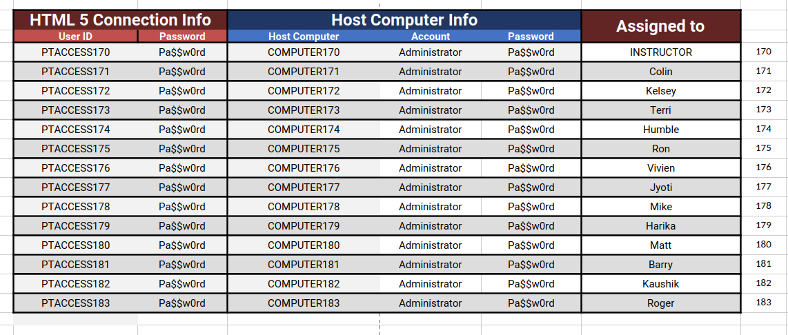
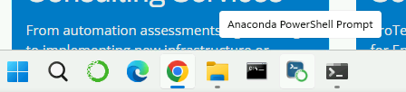
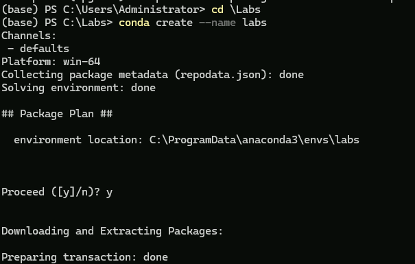
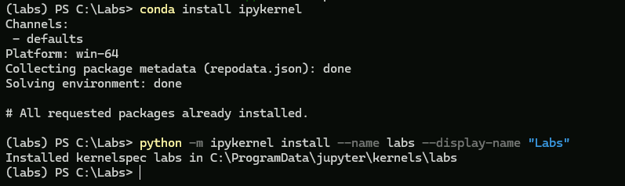
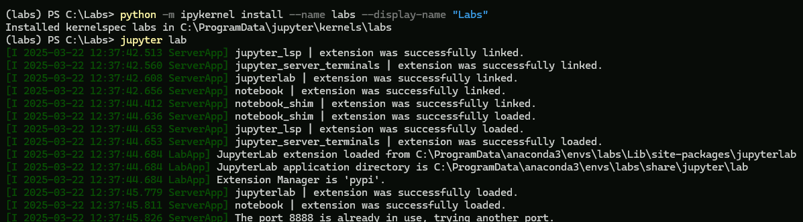
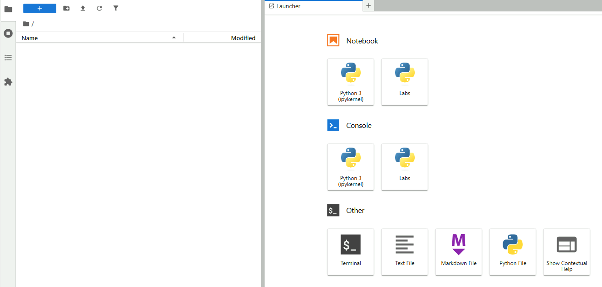

# Lab 1 - Setup

In this lab you will log into your VM and set up a Python environment.

---

## Step 1: Access VM

- Tne instructor will walk you through the process of accessing and logging into your assigned lab machine.
- Use the following chart to find your machine assignment



- The labs folder from this repository is also available in the repository [Python Labs](https://github.com/ExgnosisClasses/2505-Labs)
- This allows you to clone the lab folder into the VM without copying all the other class materials
- The lab repository wil be deleted at the end of the course on April 2 since it is just a copy of Labs folder in the main repository

#### Availability

- The lab machines will be available for your exclusive use continuously during the course until the evening of the last day of the course.
- Ensure that if you are going to be logging on from multiple computers or browsers during the course, that you log out of each lab machine session before opening another session.

--- 

## Step 2: Create a virtual environment

- We are using anaconda as the virtual environment tool as our default. However, there are other options that you are free to explore.
- We will be using a virtual environment for the first series of labs since this is a generally accepted good practice for developing Python scripts in production environments.

#### Create a working directory

- Create a folder for your work. In these examples, the labs are being done in `C:\Labs`
- There is an `Anaconda Powershell Prompt` pinned to the task bar



- Click on this to open conda shell
- You will notice the `(base)` notation to the left of the prompt, this shows that we are working in that shell in the default base environment used by Anaconda. Generally, we don't work with this to keep it pristine.
- In the shell, change to the labs directory you created


#### Create the virtual environment

Execute the following command to create the new environment which will be called `labs` in these notes.
- You will be prompted to continue, enter `y`

```shell
conda create --name labs
```



- The environment location is _not_ where your work is stored, it is where the configuration information and installed Python packages installed in the env are located.

#### Activate the environment

Because we want to install Juptyer into our new environment, we have to activate it. First, deactivate the `base` environment and then activate the new `labs` environment.

```shell
conda deactivate
conda activate labs
```

#### Install Jupyter

Because we will be working in this env in our notebooks, we are installing Jupyter and then telling Jupyter that this env should be available to notebooks (where it is called `kernel`)

```shell
conda install jupyter
conda install ipykernel
python -m ipykernel install --user --name lab --display-name "Python (lab)"
```

    

Then start the Jupyter lab environment.  It will appear in a browser, you may be prompted for one the first time you use the lab. When it starts, you will see your lab environment.



And the lab screen.



Open a new notebook using the Labs tab.

## Step 3: Create a notebook and test.

The instructor will walk through how to use a Jupyter notebook

Create a notebook using the Labs kernel, then save it as `lab1`

In a code cell, execute

```python
import this
```
And see the output.

